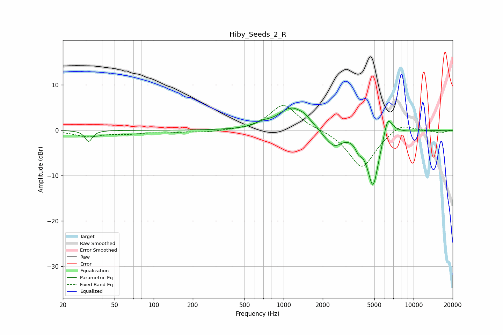

# Hiby_Seeds_2_R
See [usage instructions](https://github.com/jaakkopasanen/AutoEq#usage) for more options and info.

### Parametric EQs
Apply preamp of -5.0 dB when using parametric equalizer.

|   # | Type    |   Fc (Hz) |    Q |   Gain (dB) |
|-----|---------|-----------|------|-------------|
|   1 | Peaking |        32 | 5.4  |        -2.5 |
|   2 | Peaking |       688 | 2.92 |         0.7 |
|   3 | Peaking |      1155 | 1.35 |         5   |
|   4 | Peaking |      1458 | 4.01 |         0.7 |
|   5 | Peaking |      2044 | 4.58 |        -0.4 |
|   6 | Peaking |      2440 | 2.35 |        -3.4 |
|   7 | Peaking |      3776 | 5.94 |        -1.7 |
|   8 | Peaking |      4875 | 2.99 |       -12.6 |
|   9 | Peaking |      6315 | 4.39 |         4.3 |
|  10 | Peaking |      6808 | 2.21 |         1.1 |

### Fixed Band EQs
When using fixed band (also called graphic) equalizer, apply preamp of **-5.6 dB** (if available) and set gains manually with these parameters.

|   # | Type    |   Fc (Hz) |    Q |   Gain (dB) |
|-----|---------|-----------|------|-------------|
|   1 | Peaking |        31 | 1.41 |        -1.3 |
|   2 | Peaking |        62 | 1.41 |        -0.6 |
|   3 | Peaking |       125 | 1.41 |        -0.4 |
|   4 | Peaking |       250 | 1.41 |        -0.4 |
|   5 | Peaking |       500 | 1.41 |        -0   |
|   6 | Peaking |      1000 | 1.41 |         5.8 |
|   7 | Peaking |      2000 | 1.41 |         0.2 |
|   8 | Peaking |      4000 | 1.41 |        -8.4 |
|   9 | Peaking |      8000 | 1.41 |         1.9 |
|  10 | Peaking |     16000 | 1.41 |        -0.6 |

### Graphs

