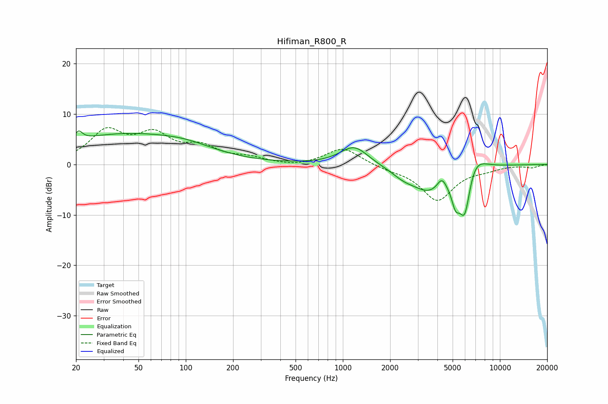

# Hifiman_R800_R
See [usage instructions](https://github.com/jaakkopasanen/AutoEq#usage) for more options and info.

### Parametric EQs
Apply preamp of -6.7 dB when using parametric equalizer.

|   # | Type    |   Fc (Hz) |    Q |   Gain (dB) |
|-----|---------|-----------|------|-------------|
|   1 | Peaking |        21 | 6    |         1.8 |
|   2 | Peaking |        39 | 0.34 |         5.8 |
|   3 | Peaking |       100 | 0.8  |         1.3 |
|   4 | Peaking |      1183 | 1.56 |         3.9 |
|   5 | Peaking |      2413 | 2.06 |        -1   |
|   6 | Peaking |      3595 | 1.08 |        -5.2 |
|   7 | Peaking |      4269 | 4.44 |         2.6 |
|   8 | Peaking |      5220 | 5.55 |        -3.7 |
|   9 | Peaking |      5974 | 3.32 |       -10.7 |
|  10 | Peaking |      6743 | 1.94 |         4.9 |

### Fixed Band EQs
When using fixed band (also called graphic) equalizer, apply preamp of **-7.4 dB** (if available) and set gains manually with these parameters.

|   # | Type    |   Fc (Hz) |    Q |   Gain (dB) |
|-----|---------|-----------|------|-------------|
|   1 | Peaking |        31 | 1.41 |         6.2 |
|   2 | Peaking |        62 | 1.41 |         5.2 |
|   3 | Peaking |       125 | 1.41 |         2.9 |
|   4 | Peaking |       250 | 1.41 |         1.1 |
|   5 | Peaking |       500 | 1.41 |        -0.5 |
|   6 | Peaking |      1000 | 1.41 |         3.4 |
|   7 | Peaking |      2000 | 1.41 |        -0.7 |
|   8 | Peaking |      4000 | 1.41 |        -7   |
|   9 | Peaking |      8000 | 1.41 |        -0.7 |
|  10 | Peaking |     16000 | 1.41 |        -0.6 |

### Graphs

