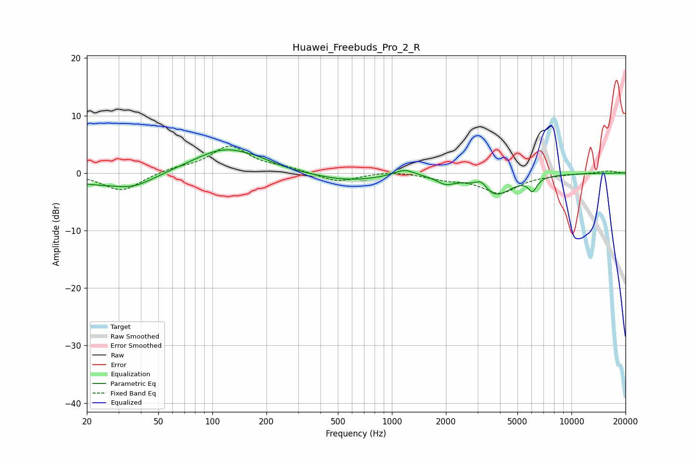

# Huawei_Freebuds_Pro_2_R
See [usage instructions](https://github.com/jaakkopasanen/AutoEq#usage) for more options and info.

### Parametric EQs
Apply preamp of -4.1 dB when using parametric equalizer.

|   # | Type    |   Fc (Hz) |    Q |   Gain (dB) |
|-----|---------|-----------|------|-------------|
|   1 | Peaking |        20 | 1    |        -1.4 |
|   2 | Peaking |        36 | 1.14 |        -2.3 |
|   3 | Peaking |       117 | 0.82 |         4.2 |
|   4 | Peaking |       182 | 1.9  |         0.5 |
|   5 | Peaking |       565 | 0.75 |        -1.4 |
|   6 | Peaking |      1173 | 2.48 |         1.2 |
|   7 | Peaking |      1990 | 2.92 |        -1.3 |
|   8 | Peaking |      3154 | 4.23 |         1.7 |
|   9 | Peaking |      3716 | 1.49 |        -4   |
|  10 | Peaking |      6075 | 5.82 |        -2.2 |

### Fixed Band EQs
When using fixed band (also called graphic) equalizer, apply preamp of **-4.8 dB** (if available) and set gains manually with these parameters.

|   # | Type    |   Fc (Hz) |    Q |   Gain (dB) |
|-----|---------|-----------|------|-------------|
|   1 | Peaking |        31 | 1.41 |        -3.2 |
|   2 | Peaking |        62 | 1.41 |         0.7 |
|   3 | Peaking |       125 | 1.41 |         4.6 |
|   4 | Peaking |       250 | 1.41 |         0.7 |
|   5 | Peaking |       500 | 1.41 |        -1.6 |
|   6 | Peaking |      1000 | 1.41 |         0.4 |
|   7 | Peaking |      2000 | 1.41 |        -0.9 |
|   8 | Peaking |      4000 | 1.41 |        -3.3 |
|   9 | Peaking |      8000 | 1.41 |        -0.2 |
|  10 | Peaking |     16000 | 1.41 |         0.4 |

### Graphs

