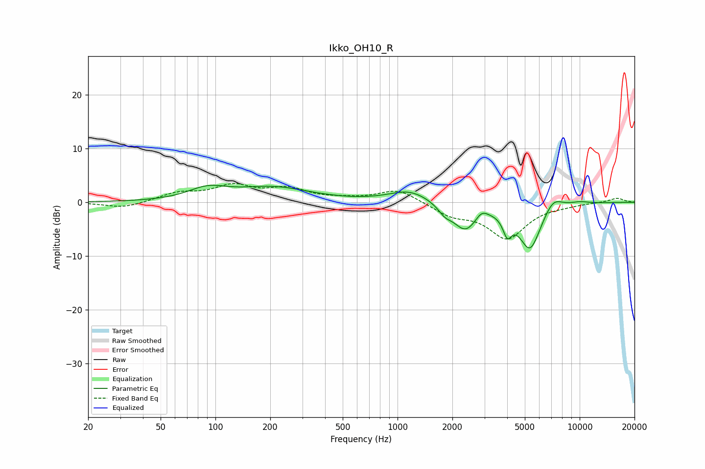

# Ikko_OH10_R
See [usage instructions](https://github.com/jaakkopasanen/AutoEq#usage) for more options and info.

### Parametric EQs
Apply preamp of -3.2 dB when using parametric equalizer.

|   # | Type    |   Fc (Hz) |    Q |   Gain (dB) |
|-----|---------|-----------|------|-------------|
|   1 | Peaking |        90 | 1.34 |         2.1 |
|   2 | Peaking |       207 | 0.69 |         2.6 |
|   3 | Peaking |      1167 | 1.28 |         2.3 |
|   4 | Peaking |      1819 | 3.84 |        -1.4 |
|   5 | Peaking |      2355 | 2.1  |        -5   |
|   6 | Peaking |      2896 | 4.32 |         1.4 |
|   7 | Peaking |      4004 | 5.97 |        -3.5 |
|   8 | Peaking |      5337 | 2.25 |        -8.6 |
|   9 | Peaking |      7139 | 2.69 |         2.5 |
|  10 | Peaking |     10000 | 2.38 |         0.4 |

### Fixed Band EQs
When using fixed band (also called graphic) equalizer, apply preamp of **-3.6 dB** (if available) and set gains manually with these parameters.

|   # | Type    |   Fc (Hz) |    Q |   Gain (dB) |
|-----|---------|-----------|------|-------------|
|   1 | Peaking |        31 | 1.41 |        -1.1 |
|   2 | Peaking |        62 | 1.41 |         1.6 |
|   3 | Peaking |       125 | 1.41 |         2.8 |
|   4 | Peaking |       250 | 1.41 |         2.2 |
|   5 | Peaking |       500 | 1.41 |         0.4 |
|   6 | Peaking |      1000 | 1.41 |         2.5 |
|   7 | Peaking |      2000 | 1.41 |        -2.2 |
|   8 | Peaking |      4000 | 1.41 |        -6.5 |
|   9 | Peaking |      8000 | 1.41 |        -0.3 |
|  10 | Peaking |     16000 | 1.41 |         0.8 |

### Graphs

