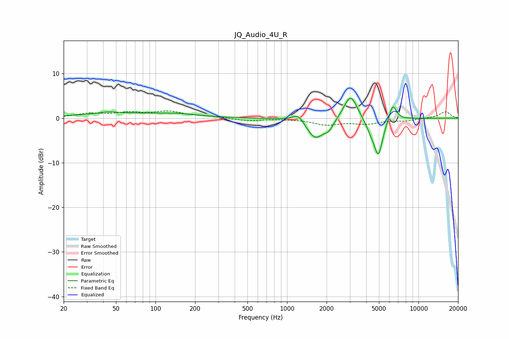

# JQ_Audio_4U_R
See [usage instructions](https://github.com/jaakkopasanen/AutoEq#usage) for more options and info.

### Parametric EQs
Apply preamp of -4.6 dB when using parametric equalizer.

|   # | Type    |   Fc (Hz) |    Q |   Gain (dB) |
|-----|---------|-----------|------|-------------|
|   1 | Peaking |        43 | 2.53 |         0.4 |
|   2 | Peaking |        59 | 0.39 |         1.1 |
|   3 | Peaking |       153 | 1.09 |         0.5 |
|   4 | Peaking |      1221 | 3.14 |         2   |
|   5 | Peaking |      1634 | 2.09 |        -4.7 |
|   6 | Peaking |      2083 | 3.96 |        -1.7 |
|   7 | Peaking |      3044 | 2.72 |         5.7 |
|   8 | Peaking |      4334 | 3.46 |        -1.9 |
|   9 | Peaking |      4953 | 4.12 |        -8   |
|  10 | Peaking |      6363 | 4.82 |         3.8 |

### Fixed Band EQs
When using fixed band (also called graphic) equalizer, apply preamp of **-1.7 dB** (if available) and set gains manually with these parameters.

|   # | Type    |   Fc (Hz) |    Q |   Gain (dB) |
|-----|---------|-----------|------|-------------|
|   1 | Peaking |        31 | 1.41 |         0.9 |
|   2 | Peaking |        62 | 1.41 |         1   |
|   3 | Peaking |       125 | 1.41 |         1.4 |
|   4 | Peaking |       250 | 1.41 |         0.4 |
|   5 | Peaking |       500 | 1.41 |        -0.6 |
|   6 | Peaking |      1000 | 1.41 |        -0.1 |
|   7 | Peaking |      2000 | 1.41 |        -1.4 |
|   8 | Peaking |      4000 | 1.41 |        -1.1 |
|   9 | Peaking |      8000 | 1.41 |        -0.5 |
|  10 | Peaking |     16000 | 1.41 |         1.5 |

### Graphs

