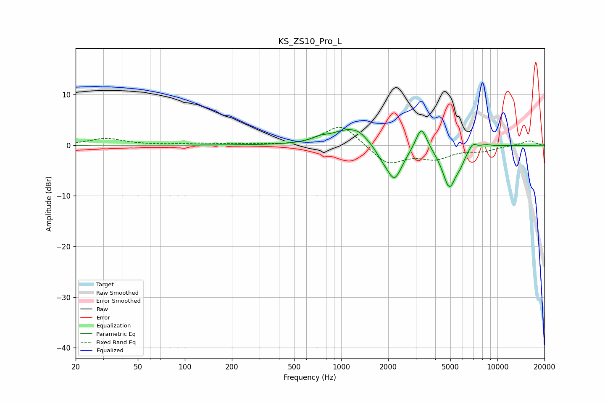

# KS_ZS10_Pro_L
See [usage instructions](https://github.com/jaakkopasanen/AutoEq#usage) for more options and info.

### Parametric EQs
Apply preamp of -3.2 dB when using parametric equalizer.

|   # | Type    |   Fc (Hz) |    Q |   Gain (dB) |
|-----|---------|-----------|------|-------------|
|   1 | Peaking |       728 | 2.83 |         0.7 |
|   2 | Peaking |      1125 | 1.27 |         3.2 |
|   3 | Peaking |      1312 | 3.25 |         0.6 |
|   4 | Peaking |      1809 | 3.61 |        -1.1 |
|   5 | Peaking |      2187 | 2.66 |        -7   |
|   6 | Peaking |      3262 | 3.95 |         4.8 |
|   7 | Peaking |      4925 | 3.08 |        -8.1 |
|   8 | Peaking |      5782 | 5.18 |        -1.4 |
|   9 | Peaking |      6934 | 5.52 |         1.3 |
|  10 | Peaking |      8285 | 2.8  |         0.5 |

### Fixed Band EQs
When using fixed band (also called graphic) equalizer, apply preamp of **-3.6 dB** (if available) and set gains manually with these parameters.

|   # | Type    |   Fc (Hz) |    Q |   Gain (dB) |
|-----|---------|-----------|------|-------------|
|   1 | Peaking |        31 | 1.41 |         1.3 |
|   2 | Peaking |        62 | 1.41 |         0   |
|   3 | Peaking |       125 | 1.41 |         0.3 |
|   4 | Peaking |       250 | 1.41 |         0.2 |
|   5 | Peaking |       500 | 1.41 |        -0.1 |
|   6 | Peaking |      1000 | 1.41 |         4.3 |
|   7 | Peaking |      2000 | 1.41 |        -3.8 |
|   8 | Peaking |      4000 | 1.41 |        -2.3 |
|   9 | Peaking |      8000 | 1.41 |        -1   |
|  10 | Peaking |     16000 | 1.41 |         0.9 |

### Graphs

