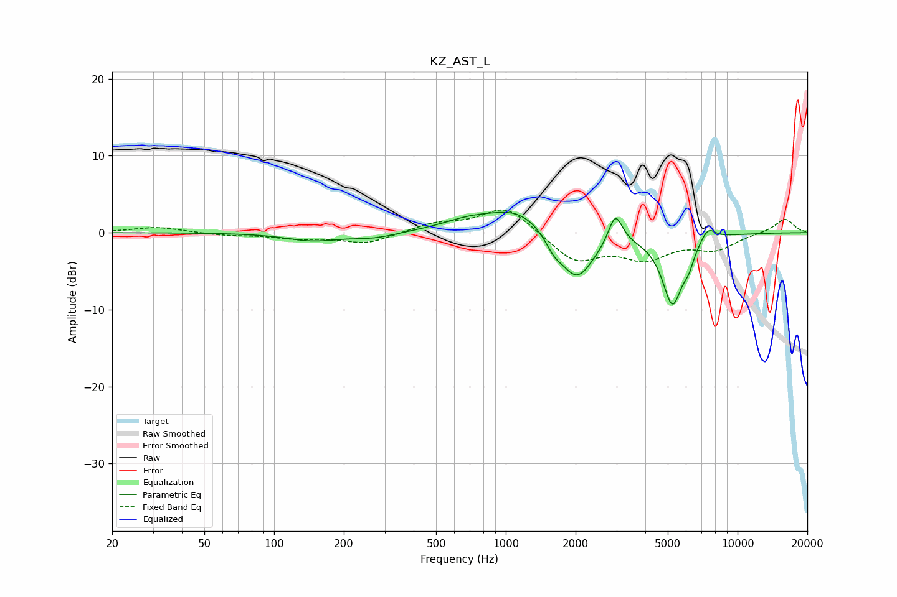

# KZ_AST_L
See [usage instructions](https://github.com/jaakkopasanen/AutoEq#usage) for more options and info.

### Parametric EQs
Apply preamp of -2.7 dB when using parametric equalizer.

|   # | Type    |   Fc (Hz) |    Q |   Gain (dB) |
|-----|---------|-----------|------|-------------|
|   1 | Peaking |       146 | 1.27 |        -1   |
|   2 | Peaking |       270 | 1.41 |        -0.7 |
|   3 | Peaking |       701 | 1.13 |         1.4 |
|   4 | Peaking |      1152 | 1.14 |         3   |
|   5 | Peaking |      1608 | 3.98 |        -1.5 |
|   6 | Peaking |      2022 | 1.86 |        -6.4 |
|   7 | Peaking |      2971 | 4.64 |         4.1 |
|   8 | Peaking |      5238 | 3.08 |        -9   |
|   9 | Peaking |      6151 | 5.99 |        -1.7 |
|  10 | Peaking |      7442 | 4.1  |         1.8 |

### Fixed Band EQs
When using fixed band (also called graphic) equalizer, apply preamp of **-3.0 dB** (if available) and set gains manually with these parameters.

|   # | Type    |   Fc (Hz) |    Q |   Gain (dB) |
|-----|---------|-----------|------|-------------|
|   1 | Peaking |        31 | 1.41 |         0.7 |
|   2 | Peaking |        62 | 1.41 |        -0.3 |
|   3 | Peaking |       125 | 1.41 |        -0.6 |
|   4 | Peaking |       250 | 1.41 |        -1.4 |
|   5 | Peaking |       500 | 1.41 |         1.1 |
|   6 | Peaking |      1000 | 1.41 |         3.5 |
|   7 | Peaking |      2000 | 1.41 |        -3.7 |
|   8 | Peaking |      4000 | 1.41 |        -3   |
|   9 | Peaking |      8000 | 1.41 |        -2   |
|  10 | Peaking |     16000 | 1.41 |         1.9 |

### Graphs

