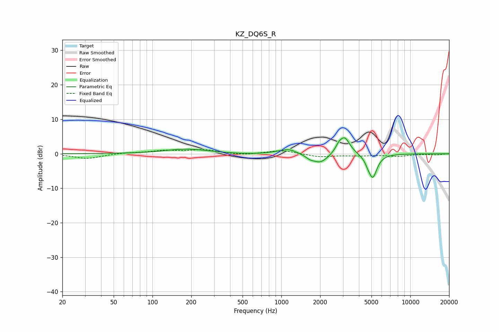

# KZ_DQ6S_R
See [usage instructions](https://github.com/jaakkopasanen/AutoEq#usage) for more options and info.

### Parametric EQs
Apply preamp of -4.7 dB when using parametric equalizer.

|   # | Type    |   Fc (Hz) |    Q |   Gain (dB) |
|-----|---------|-----------|------|-------------|
|   1 | Peaking |       185 | 0.85 |         1.4 |
|   2 | Peaking |       549 | 0.86 |        -0.2 |
|   3 | Peaking |       927 | 1.82 |         0.3 |
|   4 | Peaking |      1142 | 2.4  |         1.3 |
|   5 | Peaking |      1667 | 4.4  |        -0.8 |
|   6 | Peaking |      2010 | 2.39 |        -2.7 |
|   7 | Peaking |      2781 | 5.99 |         1.2 |
|   8 | Peaking |      3091 | 3.39 |         4.9 |
|   9 | Peaking |      4702 | 6    |        -1.1 |
|  10 | Peaking |      5122 | 4.24 |        -6.6 |

### Fixed Band EQs
When using fixed band (also called graphic) equalizer, apply preamp of **-1.3 dB** (if available) and set gains manually with these parameters.

|   # | Type    |   Fc (Hz) |    Q |   Gain (dB) |
|-----|---------|-----------|------|-------------|
|   1 | Peaking |        31 | 1.41 |        -1.4 |
|   2 | Peaking |        62 | 1.41 |         0.3 |
|   3 | Peaking |       125 | 1.41 |         0.8 |
|   4 | Peaking |       250 | 1.41 |         1.1 |
|   5 | Peaking |       500 | 1.41 |        -0.4 |
|   6 | Peaking |      1000 | 1.41 |         1   |
|   7 | Peaking |      2000 | 1.41 |        -0.9 |
|   8 | Peaking |      4000 | 1.41 |        -0.5 |
|   9 | Peaking |      8000 | 1.41 |        -0.7 |
|  10 | Peaking |     16000 | 1.41 |        -0.3 |

### Graphs

