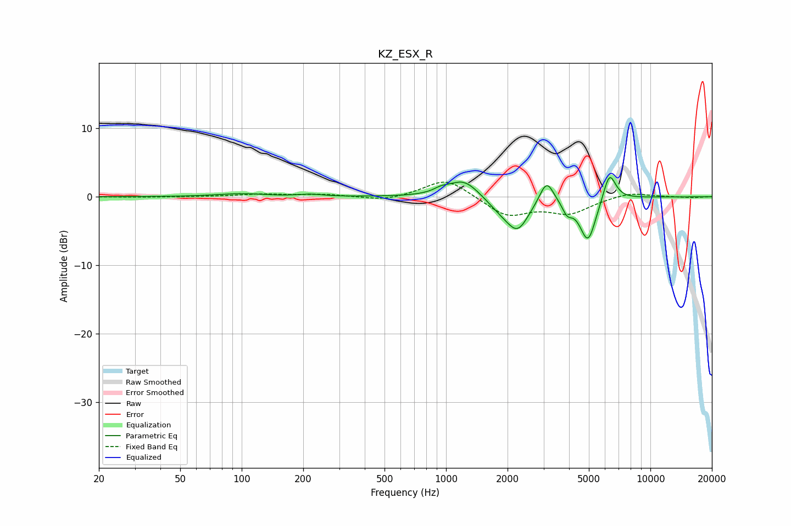

# KZ_ESX_R
See [usage instructions](https://github.com/jaakkopasanen/AutoEq#usage) for more options and info.

### Parametric EQs
Apply preamp of -2.9 dB when using parametric equalizer.

|   # | Type    |   Fc (Hz) |    Q |   Gain (dB) |
|-----|---------|-----------|------|-------------|
|   1 | Peaking |        99 | 1.22 |         0.4 |
|   2 | Peaking |       216 | 2.63 |         0.3 |
|   3 | Peaking |       946 | 3.97 |         0.5 |
|   4 | Peaking |      1222 | 1.86 |         2.7 |
|   5 | Peaking |      1831 | 2.06 |        -1.3 |
|   6 | Peaking |      2239 | 2.52 |        -4.5 |
|   7 | Peaking |      3106 | 4.1  |         3.4 |
|   8 | Peaking |      3915 | 5.99 |        -1.6 |
|   9 | Peaking |      4948 | 3.46 |        -6.5 |
|  10 | Peaking |      6302 | 4.42 |         4.3 |

### Fixed Band EQs
When using fixed band (also called graphic) equalizer, apply preamp of **-2.2 dB** (if available) and set gains manually with these parameters.

|   # | Type    |   Fc (Hz) |    Q |   Gain (dB) |
|-----|---------|-----------|------|-------------|
|   1 | Peaking |        31 | 1.41 |        -0.1 |
|   2 | Peaking |        62 | 1.41 |         0   |
|   3 | Peaking |       125 | 1.41 |         0.4 |
|   4 | Peaking |       250 | 1.41 |         0.3 |
|   5 | Peaking |       500 | 1.41 |        -0.6 |
|   6 | Peaking |      1000 | 1.41 |         2.8 |
|   7 | Peaking |      2000 | 1.41 |        -2.8 |
|   8 | Peaking |      4000 | 1.41 |        -2.3 |
|   9 | Peaking |      8000 | 1.41 |         0.7 |
|  10 | Peaking |     16000 | 1.41 |        -0.1 |

### Graphs

