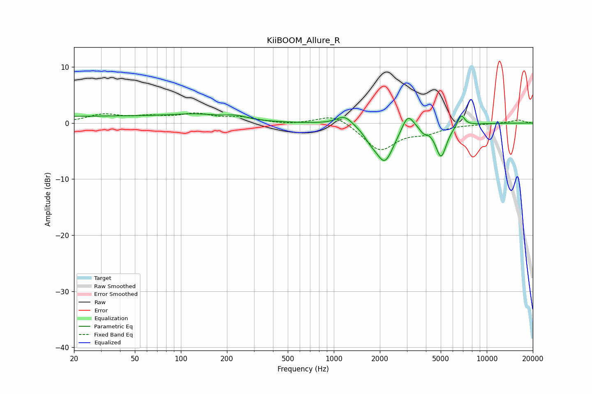

# KiiBOOM_Allure_R
See [usage instructions](https://github.com/jaakkopasanen/AutoEq#usage) for more options and info.

### Parametric EQs
Apply preamp of -1.7 dB when using parametric equalizer.

|   # | Type    |   Fc (Hz) |    Q |   Gain (dB) |
|-----|---------|-----------|------|-------------|
|   1 | Peaking |        29 | 0.18 |         1.2 |
|   2 | Peaking |       131 | 0.85 |         0.8 |
|   3 | Peaking |       232 | 2.16 |         0.6 |
|   4 | Peaking |      1175 | 2.67 |         1.7 |
|   5 | Peaking |      1736 | 3.5  |        -1.2 |
|   6 | Peaking |      2151 | 2.33 |        -6.7 |
|   7 | Peaking |      3046 | 3.75 |         3   |
|   8 | Peaking |      3855 | 5.98 |        -0.9 |
|   9 | Peaking |      5026 | 3.85 |        -5.8 |
|  10 | Peaking |      6802 | 5.94 |         2.1 |

### Fixed Band EQs
When using fixed band (also called graphic) equalizer, apply preamp of **-1.9 dB** (if available) and set gains manually with these parameters.

|   # | Type    |   Fc (Hz) |    Q |   Gain (dB) |
|-----|---------|-----------|------|-------------|
|   1 | Peaking |        31 | 1.41 |         1.4 |
|   2 | Peaking |        62 | 1.41 |         0.9 |
|   3 | Peaking |       125 | 1.41 |         1.4 |
|   4 | Peaking |       250 | 1.41 |         0.9 |
|   5 | Peaking |       500 | 1.41 |        -0.3 |
|   6 | Peaking |      1000 | 1.41 |         1.8 |
|   7 | Peaking |      2000 | 1.41 |        -4.8 |
|   8 | Peaking |      4000 | 1.41 |        -1.4 |
|   9 | Peaking |      8000 | 1.41 |        -0.1 |
|  10 | Peaking |     16000 | 1.41 |         0.6 |

### Graphs

