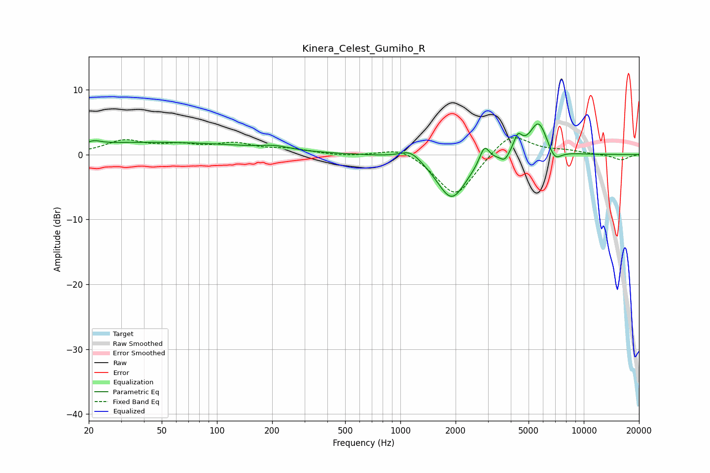

# Kinera_Celest_Gumiho_R
See [usage instructions](https://github.com/jaakkopasanen/AutoEq#usage) for more options and info.

### Parametric EQs
Apply preamp of -4.8 dB when using parametric equalizer.

|   # | Type    |   Fc (Hz) |    Q |   Gain (dB) |
|-----|---------|-----------|------|-------------|
|   1 | Peaking |        21 | 4.15 |         0.5 |
|   2 | Peaking |        44 | 0.24 |         1.9 |
|   3 | Peaking |       208 | 1.85 |         0.5 |
|   4 | Peaking |      1138 | 2.4  |         1.6 |
|   5 | Peaking |      1904 | 1.74 |        -6.9 |
|   6 | Peaking |      2873 | 5.32 |         2.8 |
|   7 | Peaking |      3709 | 6    |        -1.1 |
|   8 | Peaking |      4368 | 5.96 |         2.5 |
|   9 | Peaking |      5676 | 2.79 |         5.3 |
|  10 | Peaking |      6915 | 3.68 |        -2.1 |

### Fixed Band EQs
When using fixed band (also called graphic) equalizer, apply preamp of **-2.7 dB** (if available) and set gains manually with these parameters.

|   # | Type    |   Fc (Hz) |    Q |   Gain (dB) |
|-----|---------|-----------|------|-------------|
|   1 | Peaking |        31 | 1.41 |         2   |
|   2 | Peaking |        62 | 1.41 |         1.2 |
|   3 | Peaking |       125 | 1.41 |         1.5 |
|   4 | Peaking |       250 | 1.41 |         0.7 |
|   5 | Peaking |       500 | 1.41 |        -0.3 |
|   6 | Peaking |      1000 | 1.41 |         1.4 |
|   7 | Peaking |      2000 | 1.41 |        -6.7 |
|   8 | Peaking |      4000 | 1.41 |         3.6 |
|   9 | Peaking |      8000 | 1.41 |         0.5 |
|  10 | Peaking |     16000 | 1.41 |        -0.8 |

### Graphs

