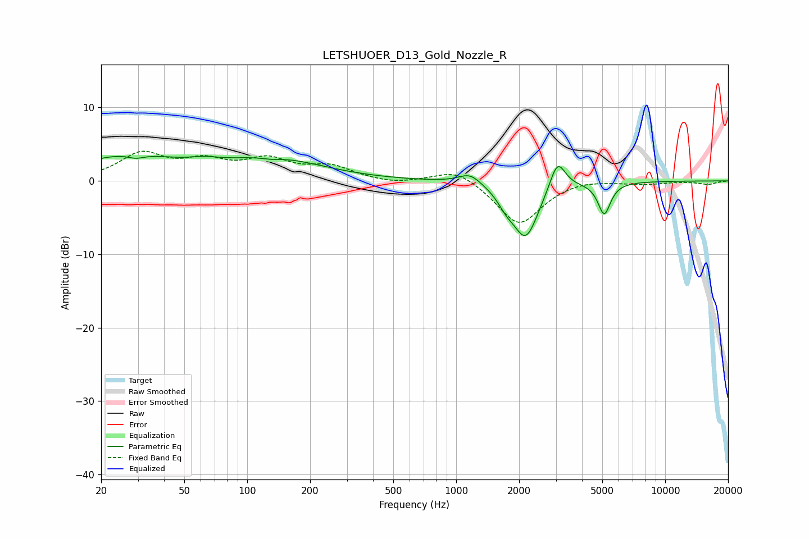

# LETSHUOER_D13_Gold_Nozzle_R
See [usage instructions](https://github.com/jaakkopasanen/AutoEq#usage) for more options and info.

### Parametric EQs
Apply preamp of -3.5 dB when using parametric equalizer.

|   # | Type    |   Fc (Hz) |    Q |   Gain (dB) |
|-----|---------|-----------|------|-------------|
|   1 | Peaking |        27 | 0.61 |         3.3 |
|   2 | Peaking |        29 | 3.37 |        -0.6 |
|   3 | Peaking |        62 | 2.07 |         0.6 |
|   4 | Peaking |       131 | 2.66 |        -0.3 |
|   5 | Peaking |       133 | 0.6  |         2.9 |
|   6 | Peaking |      1165 | 2.63 |         1.5 |
|   7 | Peaking |      1734 | 3.56 |        -1.4 |
|   8 | Peaking |      2152 | 2.25 |        -7.6 |
|   9 | Peaking |      3052 | 3.75 |         4.2 |
|  10 | Peaking |      5111 | 4.74 |        -4.3 |

### Fixed Band EQs
When using fixed band (also called graphic) equalizer, apply preamp of **-4.1 dB** (if available) and set gains manually with these parameters.

|   # | Type    |   Fc (Hz) |    Q |   Gain (dB) |
|-----|---------|-----------|------|-------------|
|   1 | Peaking |        31 | 1.41 |         3.5 |
|   2 | Peaking |        62 | 1.41 |         2.3 |
|   3 | Peaking |       125 | 1.41 |         2.6 |
|   4 | Peaking |       250 | 1.41 |         1.8 |
|   5 | Peaking |       500 | 1.41 |        -0.5 |
|   6 | Peaking |      1000 | 1.41 |         1.9 |
|   7 | Peaking |      2000 | 1.41 |        -6   |
|   8 | Peaking |      4000 | 1.41 |         0.4 |
|   9 | Peaking |      8000 | 1.41 |        -0.4 |
|  10 | Peaking |     16000 | 1.41 |        -0.5 |

### Graphs

