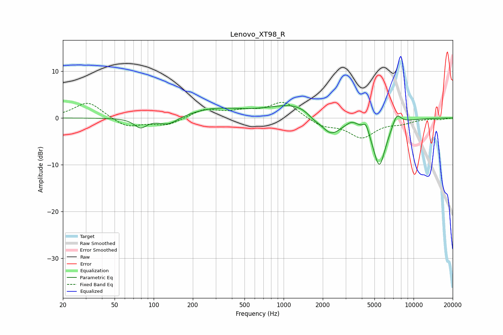

# Lenovo_XT98_R
See [usage instructions](https://github.com/jaakkopasanen/AutoEq#usage) for more options and info.

### Parametric EQs
Apply preamp of -2.7 dB when using parametric equalizer.

|   # | Type    |   Fc (Hz) |    Q |   Gain (dB) |
|-----|---------|-----------|------|-------------|
|   1 | Peaking |        79 | 2.94 |        -2   |
|   2 | Peaking |       130 | 1.87 |        -1.8 |
|   3 | Peaking |       294 | 0.71 |         1.9 |
|   4 | Peaking |      1331 | 0.65 |         3.4 |
|   5 | Peaking |      1698 | 2.78 |        -1.1 |
|   6 | Peaking |      2304 | 1.66 |        -4.8 |
|   7 | Peaking |      3344 | 3.71 |         0.8 |
|   8 | Peaking |      4302 | 6    |         2.1 |
|   9 | Peaking |      5448 | 2.64 |       -10.5 |
|  10 | Peaking |      7420 | 4.02 |         2.7 |

### Fixed Band EQs
When using fixed band (also called graphic) equalizer, apply preamp of **-3.4 dB** (if available) and set gains manually with these parameters.

|   # | Type    |   Fc (Hz) |    Q |   Gain (dB) |
|-----|---------|-----------|------|-------------|
|   1 | Peaking |        31 | 1.41 |         3.5 |
|   2 | Peaking |        62 | 1.41 |        -2   |
|   3 | Peaking |       125 | 1.41 |        -1.6 |
|   4 | Peaking |       250 | 1.41 |         1.8 |
|   5 | Peaking |       500 | 1.41 |         1.2 |
|   6 | Peaking |      1000 | 1.41 |         3.5 |
|   7 | Peaking |      2000 | 1.41 |        -1.7 |
|   8 | Peaking |      4000 | 1.41 |        -4   |
|   9 | Peaking |      8000 | 1.41 |        -0.9 |
|  10 | Peaking |     16000 | 1.41 |        -0.3 |

### Graphs

