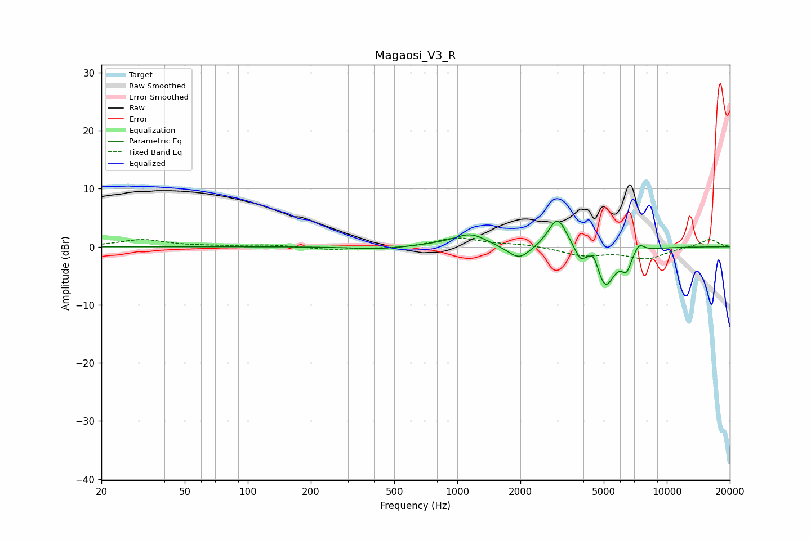

# Magaosi_V3_R
See [usage instructions](https://github.com/jaakkopasanen/AutoEq#usage) for more options and info.

### Parametric EQs
Apply preamp of -4.5 dB when using parametric equalizer.

|   # | Type    |   Fc (Hz) |    Q |   Gain (dB) |
|-----|---------|-----------|------|-------------|
|   1 | Peaking |       422 | 1.17 |        -0.4 |
|   2 | Peaking |       879 | 1.15 |         0.4 |
|   3 | Peaking |      1161 | 1.91 |         2   |
|   4 | Peaking |      1972 | 2.62 |        -2.5 |
|   5 | Peaking |      3006 | 3.24 |         5.4 |
|   6 | Peaking |      3854 | 6    |        -1.9 |
|   7 | Peaking |      4490 | 6    |         2.2 |
|   8 | Peaking |      5074 | 3    |        -7   |
|   9 | Peaking |      6420 | 5.98 |        -2.9 |
|  10 | Peaking |      7373 | 5.78 |         1.5 |

### Fixed Band EQs
When using fixed band (also called graphic) equalizer, apply preamp of **-1.6 dB** (if available) and set gains manually with these parameters.

|   # | Type    |   Fc (Hz) |    Q |   Gain (dB) |
|-----|---------|-----------|------|-------------|
|   1 | Peaking |        31 | 1.41 |         1.2 |
|   2 | Peaking |        62 | 1.41 |         0.1 |
|   3 | Peaking |       125 | 1.41 |         0.3 |
|   4 | Peaking |       250 | 1.41 |        -0.5 |
|   5 | Peaking |       500 | 1.41 |        -0.3 |
|   6 | Peaking |      1000 | 1.41 |         1.5 |
|   7 | Peaking |      2000 | 1.41 |         0.4 |
|   8 | Peaking |      4000 | 1.41 |        -1.4 |
|   9 | Peaking |      8000 | 1.41 |        -2   |
|  10 | Peaking |     16000 | 1.41 |         1.3 |

### Graphs

