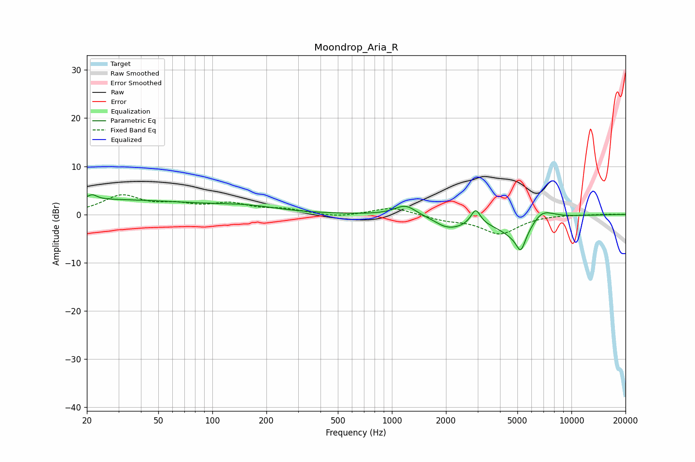

# Moondrop_Aria_R
See [usage instructions](https://github.com/jaakkopasanen/AutoEq#usage) for more options and info.

### Parametric EQs
Apply preamp of -4.2 dB when using parametric equalizer.

|   # | Type    |   Fc (Hz) |    Q |   Gain (dB) |
|-----|---------|-----------|------|-------------|
|   1 | Peaking |        20 | 0.2  |         3.1 |
|   2 | Peaking |        21 | 5.72 |         1   |
|   3 | Peaking |       157 | 0.8  |         1.1 |
|   4 | Peaking |      1190 | 2.34 |         2.2 |
|   5 | Peaking |      1939 | 3.17 |        -0.4 |
|   6 | Peaking |      2162 | 1.58 |        -2.3 |
|   7 | Peaking |      2927 | 5.5  |         3.2 |
|   8 | Peaking |      5216 | 1.32 |        -5.6 |
|   9 | Peaking |      5217 | 5.94 |        -3.3 |
|  10 | Peaking |      6724 | 1.86 |         3.7 |

### Fixed Band EQs
When using fixed band (also called graphic) equalizer, apply preamp of **-4.2 dB** (if available) and set gains manually with these parameters.

|   # | Type    |   Fc (Hz) |    Q |   Gain (dB) |
|-----|---------|-----------|------|-------------|
|   1 | Peaking |        31 | 1.41 |         3.7 |
|   2 | Peaking |        62 | 1.41 |         1.6 |
|   3 | Peaking |       125 | 1.41 |         2   |
|   4 | Peaking |       250 | 1.41 |         1   |
|   5 | Peaking |       500 | 1.41 |        -0.6 |
|   6 | Peaking |      1000 | 1.41 |         1.6 |
|   7 | Peaking |      2000 | 1.41 |        -1   |
|   8 | Peaking |      4000 | 1.41 |        -3.9 |
|   9 | Peaking |      8000 | 1.41 |         0   |
|  10 | Peaking |     16000 | 1.41 |         0.1 |

### Graphs

