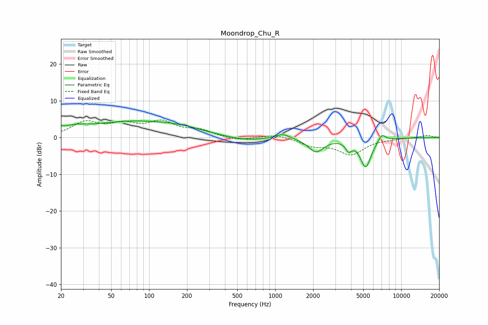

# Moondrop_Chu_R
See [usage instructions](https://github.com/jaakkopasanen/AutoEq#usage) for more options and info.

### Parametric EQs
Apply preamp of -4.6 dB when using parametric equalizer.

|   # | Type    |   Fc (Hz) |    Q |   Gain (dB) |
|-----|---------|-----------|------|-------------|
|   1 | Peaking |        20 | 5.96 |         0.7 |
|   2 | Peaking |        25 | 1.47 |         1.4 |
|   3 | Peaking |        72 | 0.4  |         4.1 |
|   4 | Peaking |       181 | 0.8  |         1.2 |
|   5 | Peaking |       572 | 1    |        -1   |
|   6 | Peaking |      1150 | 2.7  |         1.3 |
|   7 | Peaking |      2107 | 2.38 |        -3.7 |
|   8 | Peaking |      3827 | 6    |        -2.2 |
|   9 | Peaking |      5230 | 3.15 |        -7.9 |
|  10 | Peaking |      6999 | 4.54 |         2.1 |

### Fixed Band EQs
When using fixed band (also called graphic) equalizer, apply preamp of **-4.9 dB** (if available) and set gains manually with these parameters.

|   # | Type    |   Fc (Hz) |    Q |   Gain (dB) |
|-----|---------|-----------|------|-------------|
|   1 | Peaking |        31 | 1.41 |         3.9 |
|   2 | Peaking |        62 | 1.41 |         3   |
|   3 | Peaking |       125 | 1.41 |         3.8 |
|   4 | Peaking |       250 | 1.41 |         1.7 |
|   5 | Peaking |       500 | 1.41 |        -0.9 |
|   6 | Peaking |      1000 | 1.41 |         1   |
|   7 | Peaking |      2000 | 1.41 |        -2   |
|   8 | Peaking |      4000 | 1.41 |        -4.4 |
|   9 | Peaking |      8000 | 1.41 |        -0.2 |
|  10 | Peaking |     16000 | 1.41 |         0.6 |

### Graphs

