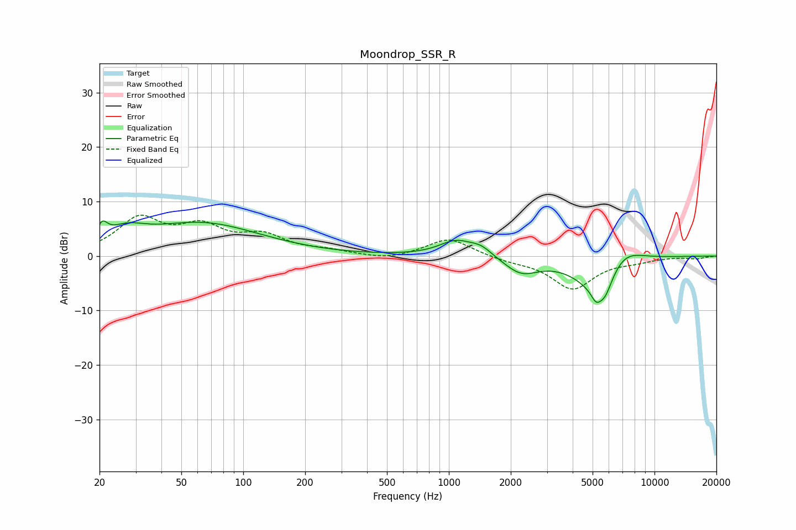

# Moondrop_SSR_R
See [usage instructions](https://github.com/jaakkopasanen/AutoEq#usage) for more options and info.

### Parametric EQs
Apply preamp of -6.5 dB when using parametric equalizer.

|   # | Type    |   Fc (Hz) |    Q |   Gain (dB) |
|-----|---------|-----------|------|-------------|
|   1 | Peaking |        21 | 5.67 |         2.7 |
|   2 | Peaking |        27 | 1.56 |         2.7 |
|   3 | Peaking |        63 | 0.49 |         5.9 |
|   4 | Peaking |      1083 | 1.71 |         2.8 |
|   5 | Peaking |      1435 | 2.56 |         1.5 |
|   6 | Peaking |      2247 | 1.73 |        -3   |
|   7 | Peaking |      5198 | 5.95 |        -1.9 |
|   8 | Peaking |      5299 | 1.28 |        -6.5 |
|   9 | Peaking |      5743 | 4.05 |        -2.9 |
|  10 | Peaking |      7011 | 1.46 |         3.6 |

### Fixed Band EQs
When using fixed band (also called graphic) equalizer, apply preamp of **-7.6 dB** (if available) and set gains manually with these parameters.

|   # | Type    |   Fc (Hz) |    Q |   Gain (dB) |
|-----|---------|-----------|------|-------------|
|   1 | Peaking |        31 | 1.41 |         6.5 |
|   2 | Peaking |        62 | 1.41 |         4.6 |
|   3 | Peaking |       125 | 1.41 |         3.2 |
|   4 | Peaking |       250 | 1.41 |         0.8 |
|   5 | Peaking |       500 | 1.41 |        -0.8 |
|   6 | Peaking |      1000 | 1.41 |         3.3 |
|   7 | Peaking |      2000 | 1.41 |        -0.7 |
|   8 | Peaking |      4000 | 1.41 |        -5.9 |
|   9 | Peaking |      8000 | 1.41 |        -0.7 |
|  10 | Peaking |     16000 | 1.41 |        -0.4 |

### Graphs

