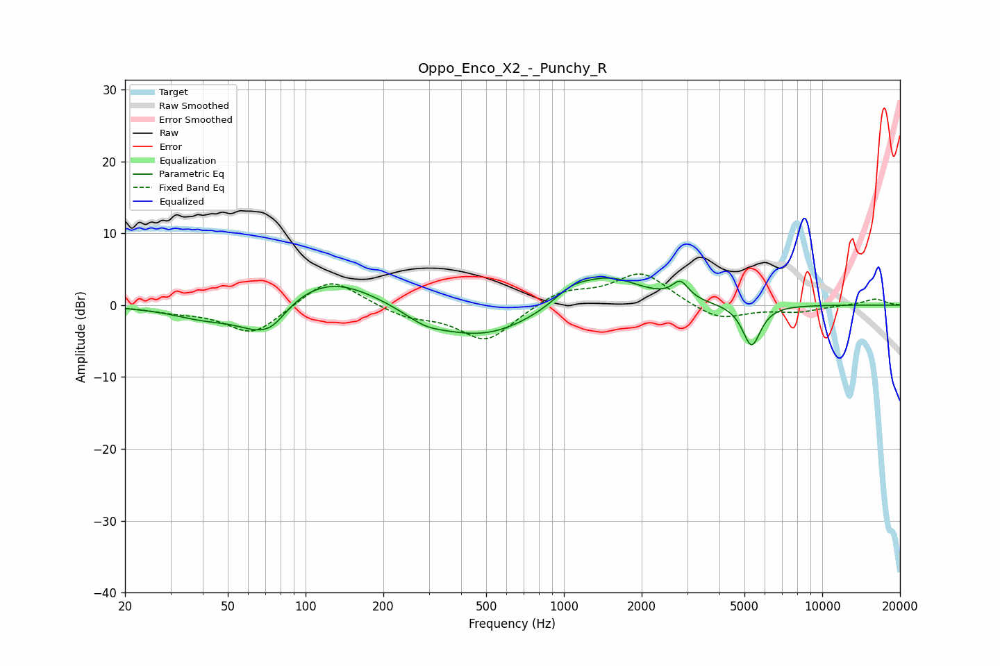

# Oppo_Enco_X2_-_Punchy_R
See [usage instructions](https://github.com/jaakkopasanen/AutoEq#usage) for more options and info.

### Parametric EQs
Apply preamp of -3.9 dB when using parametric equalizer.

|   # | Type    |   Fc (Hz) |    Q |   Gain (dB) |
|-----|---------|-----------|------|-------------|
|   1 | Peaking |        41 | 1.05 |        -1.9 |
|   2 | Peaking |        66 | 1.55 |        -3.5 |
|   3 | Peaking |        75 | 2.73 |        -1.5 |
|   4 | Peaking |       124 | 0.74 |         4.4 |
|   5 | Peaking |       290 | 1.88 |        -1.2 |
|   6 | Peaking |       478 | 0.67 |        -4.7 |
|   7 | Peaking |      1061 | 2.13 |         1.6 |
|   8 | Peaking |      1473 | 1.05 |         4.3 |
|   9 | Peaking |      2825 | 4.52 |         2.4 |
|  10 | Peaking |      5327 | 3.95 |        -5.8 |

### Fixed Band EQs
When using fixed band (also called graphic) equalizer, apply preamp of **-4.4 dB** (if available) and set gains manually with these parameters.

|   # | Type    |   Fc (Hz) |    Q |   Gain (dB) |
|-----|---------|-----------|------|-------------|
|   1 | Peaking |        31 | 1.41 |        -0.7 |
|   2 | Peaking |        62 | 1.41 |        -4.1 |
|   3 | Peaking |       125 | 1.41 |         4.2 |
|   4 | Peaking |       250 | 1.41 |        -1.5 |
|   5 | Peaking |       500 | 1.41 |        -5   |
|   6 | Peaking |      1000 | 1.41 |         2   |
|   7 | Peaking |      2000 | 1.41 |         4.5 |
|   8 | Peaking |      4000 | 1.41 |        -2.2 |
|   9 | Peaking |      8000 | 1.41 |        -0.9 |
|  10 | Peaking |     16000 | 1.41 |         0.9 |

### Graphs

