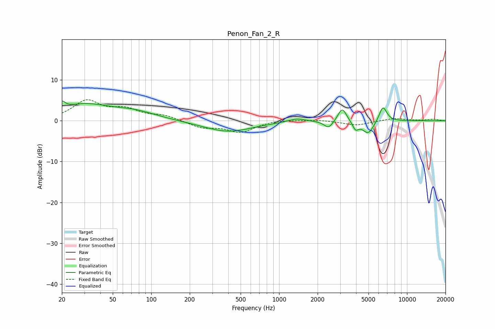

# Penon_Fan_2_R
See [usage instructions](https://github.com/jaakkopasanen/AutoEq#usage) for more options and info.

### Parametric EQs
Apply preamp of -4.9 dB when using parametric equalizer.

|   # | Type    |   Fc (Hz) |    Q |   Gain (dB) |
|-----|---------|-----------|------|-------------|
|   1 | Peaking |        20 | 5.72 |         1.8 |
|   2 | Peaking |        29 | 0.68 |         3.7 |
|   3 | Peaking |        75 | 0.82 |         1.8 |
|   4 | Peaking |       399 | 0.74 |        -2.7 |
|   5 | Peaking |      1372 | 2.16 |         0.9 |
|   6 | Peaking |      2439 | 3.96 |        -1.9 |
|   7 | Peaking |      3116 | 4.22 |         3.5 |
|   8 | Peaking |      3959 | 5.97 |        -1.9 |
|   9 | Peaking |      4971 | 3.14 |        -3.2 |
|  10 | Peaking |      6485 | 4.52 |         3.8 |

### Fixed Band EQs
When using fixed band (also called graphic) equalizer, apply preamp of **-5.2 dB** (if available) and set gains manually with these parameters.

|   # | Type    |   Fc (Hz) |    Q |   Gain (dB) |
|-----|---------|-----------|------|-------------|
|   1 | Peaking |        31 | 1.41 |         4.7 |
|   2 | Peaking |        62 | 1.41 |         2.4 |
|   3 | Peaking |       125 | 1.41 |         1.2 |
|   4 | Peaking |       250 | 1.41 |        -1.6 |
|   5 | Peaking |       500 | 1.41 |        -2.7 |
|   6 | Peaking |      1000 | 1.41 |         0.3 |
|   7 | Peaking |      2000 | 1.41 |         0.3 |
|   8 | Peaking |      4000 | 1.41 |        -1.1 |
|   9 | Peaking |      8000 | 1.41 |         0.6 |
|  10 | Peaking |     16000 | 1.41 |         0.4 |

### Graphs

