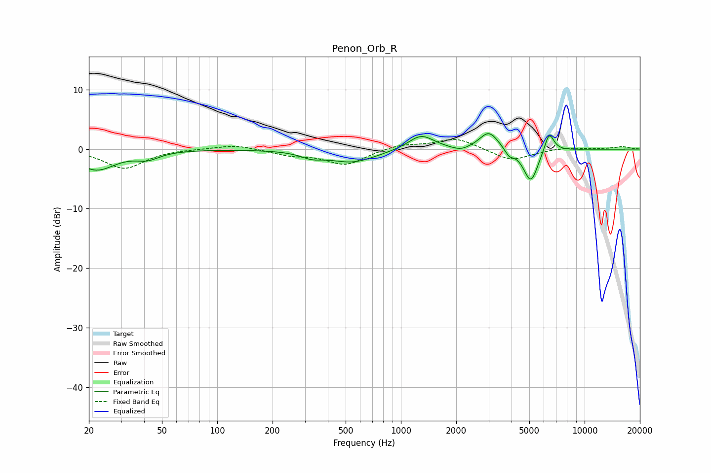

# Penon_Orb_R
See [usage instructions](https://github.com/jaakkopasanen/AutoEq#usage) for more options and info.

### Parametric EQs
Apply preamp of -2.7 dB when using parametric equalizer.

|   # | Type    |   Fc (Hz) |    Q |   Gain (dB) |
|-----|---------|-----------|------|-------------|
|   1 | Peaking |        22 | 1.37 |        -3.4 |
|   2 | Peaking |        42 | 2.21 |        -1.2 |
|   3 | Peaking |       327 | 2.35 |        -0.9 |
|   4 | Peaking |       545 | 1.11 |        -2.2 |
|   5 | Peaking |      1288 | 2.02 |         2.5 |
|   6 | Peaking |      2116 | 2.86 |        -0.7 |
|   7 | Peaking |      3013 | 2.74 |         3   |
|   8 | Peaking |      3886 | 5.8  |        -1.2 |
|   9 | Peaking |      5094 | 3.46 |        -5.6 |
|  10 | Peaking |      6413 | 5.23 |         3.5 |

### Fixed Band EQs
When using fixed band (also called graphic) equalizer, apply preamp of **-1.7 dB** (if available) and set gains manually with these parameters.

|   # | Type    |   Fc (Hz) |    Q |   Gain (dB) |
|-----|---------|-----------|------|-------------|
|   1 | Peaking |        31 | 1.41 |        -3.2 |
|   2 | Peaking |        62 | 1.41 |         0.1 |
|   3 | Peaking |       125 | 1.41 |         0.8 |
|   4 | Peaking |       250 | 1.41 |        -0.9 |
|   5 | Peaking |       500 | 1.41 |        -2.6 |
|   6 | Peaking |      1000 | 1.41 |         0.8 |
|   7 | Peaking |      2000 | 1.41 |         1.9 |
|   8 | Peaking |      4000 | 1.41 |        -2   |
|   9 | Peaking |      8000 | 1.41 |         0.3 |
|  10 | Peaking |     16000 | 1.41 |         0.4 |

### Graphs

