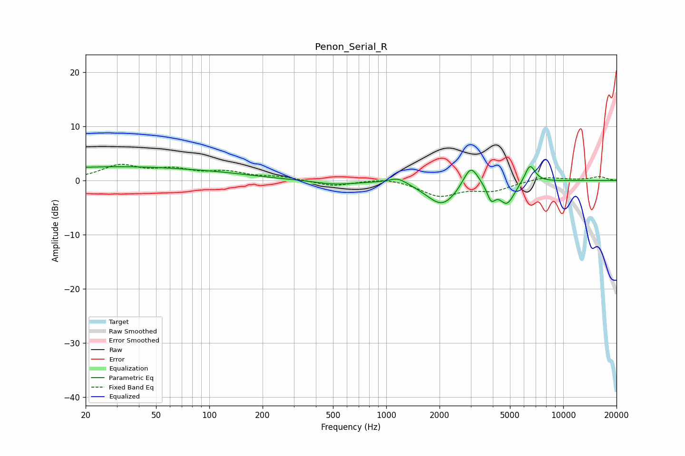

# Penon_Serial_R
See [usage instructions](https://github.com/jaakkopasanen/AutoEq#usage) for more options and info.

### Parametric EQs
Apply preamp of -2.6 dB when using parametric equalizer.

|   # | Type    |   Fc (Hz) |    Q |   Gain (dB) |
|-----|---------|-----------|------|-------------|
|   1 | Peaking |        20 | 5.98 |         0   |
|   2 | Peaking |        30 | 0.26 |         2.5 |
|   3 | Peaking |       128 | 0.85 |         0.3 |
|   4 | Peaking |       511 | 1.24 |        -0.7 |
|   5 | Peaking |      1168 | 2.66 |         1.2 |
|   6 | Peaking |      2072 | 1.59 |        -4.6 |
|   7 | Peaking |      2999 | 3.28 |         4.2 |
|   8 | Peaking |      3916 | 5.98 |        -2.7 |
|   9 | Peaking |      4808 | 3.16 |        -4.1 |
|  10 | Peaking |      6488 | 4.61 |         3.4 |

### Fixed Band EQs
When using fixed band (also called graphic) equalizer, apply preamp of **-3.1 dB** (if available) and set gains manually with these parameters.

|   # | Type    |   Fc (Hz) |    Q |   Gain (dB) |
|-----|---------|-----------|------|-------------|
|   1 | Peaking |        31 | 1.41 |         2.6 |
|   2 | Peaking |        62 | 1.41 |         1.7 |
|   3 | Peaking |       125 | 1.41 |         1.4 |
|   4 | Peaking |       250 | 1.41 |         0.6 |
|   5 | Peaking |       500 | 1.41 |        -1.1 |
|   6 | Peaking |      1000 | 1.41 |         0.6 |
|   7 | Peaking |      2000 | 1.41 |        -2.8 |
|   8 | Peaking |      4000 | 1.41 |        -1.7 |
|   9 | Peaking |      8000 | 1.41 |         0.7 |
|  10 | Peaking |     16000 | 1.41 |         0.7 |

### Graphs

