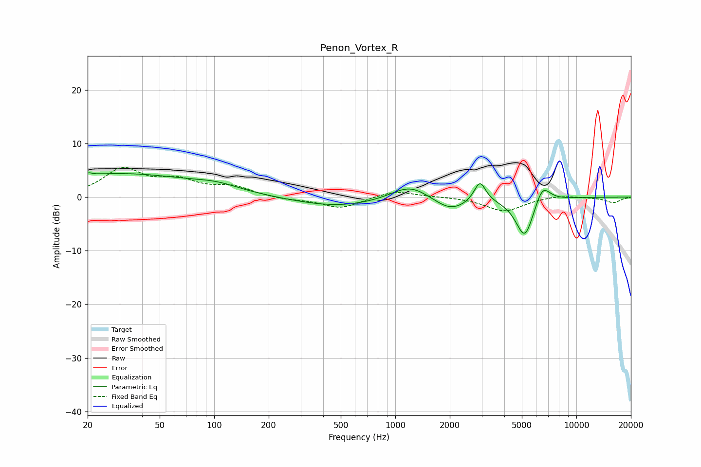

# Penon_Vortex_R
See [usage instructions](https://github.com/jaakkopasanen/AutoEq#usage) for more options and info.

### Parametric EQs
Apply preamp of -4.6 dB when using parametric equalizer.

|   # | Type    |   Fc (Hz) |    Q |   Gain (dB) |
|-----|---------|-----------|------|-------------|
|   1 | Peaking |        20 | 5.81 |         3   |
|   2 | Peaking |        20 | 5.51 |        -2.6 |
|   3 | Peaking |        29 | 0.3  |         4.3 |
|   4 | Peaking |       104 | 1.2  |         0.9 |
|   5 | Peaking |       483 | 0.58 |        -1.8 |
|   6 | Peaking |      1207 | 1.33 |         2.9 |
|   7 | Peaking |      2020 | 1.52 |        -2.6 |
|   8 | Peaking |      2933 | 4.4  |         3.9 |
|   9 | Peaking |      5190 | 2.74 |        -7.7 |
|  10 | Peaking |      6493 | 3.24 |         3.7 |

### Fixed Band EQs
When using fixed band (also called graphic) equalizer, apply preamp of **-5.6 dB** (if available) and set gains manually with these parameters.

|   # | Type    |   Fc (Hz) |    Q |   Gain (dB) |
|-----|---------|-----------|------|-------------|
|   1 | Peaking |        31 | 1.41 |         5   |
|   2 | Peaking |        62 | 1.41 |         2.7 |
|   3 | Peaking |       125 | 1.41 |         1.7 |
|   4 | Peaking |       250 | 1.41 |        -0.5 |
|   5 | Peaking |       500 | 1.41 |        -2.1 |
|   6 | Peaking |      1000 | 1.41 |         1.3 |
|   7 | Peaking |      2000 | 1.41 |         0.1 |
|   8 | Peaking |      4000 | 1.41 |        -2.6 |
|   9 | Peaking |      8000 | 1.41 |         0.4 |
|  10 | Peaking |     16000 | 1.41 |        -1   |

### Graphs

