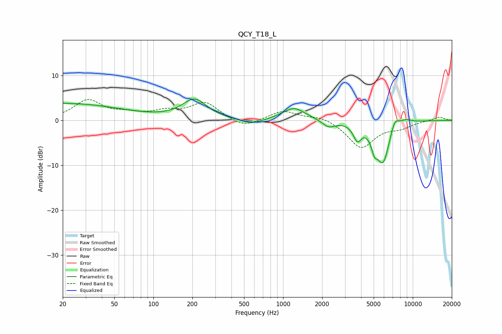

# QCY_T18_L
See [usage instructions](https://github.com/jaakkopasanen/AutoEq#usage) for more options and info.

### Parametric EQs
Apply preamp of -4.8 dB when using parametric equalizer.

|   # | Type    |   Fc (Hz) |    Q |   Gain (dB) |
|-----|---------|-----------|------|-------------|
|   1 | Peaking |        20 | 0.3  |         3.8 |
|   2 | Peaking |       208 | 1.51 |         4.4 |
|   3 | Peaking |       571 | 1.66 |        -1.1 |
|   4 | Peaking |      1213 | 1.62 |         2.8 |
|   5 | Peaking |      2245 | 3.01 |        -1.5 |
|   6 | Peaking |      3738 | 4.57 |        -3.4 |
|   7 | Peaking |      5057 | 6    |        -2.9 |
|   8 | Peaking |      5896 | 2.56 |        -9.4 |
|   9 | Peaking |      7254 | 4.02 |         2.9 |
|  10 | Peaking |      8766 | 2.62 |         1   |

### Fixed Band EQs
When using fixed band (also called graphic) equalizer, apply preamp of **-4.7 dB** (if available) and set gains manually with these parameters.

|   # | Type    |   Fc (Hz) |    Q |   Gain (dB) |
|-----|---------|-----------|------|-------------|
|   1 | Peaking |        31 | 1.41 |         4.3 |
|   2 | Peaking |        62 | 1.41 |         1.2 |
|   3 | Peaking |       125 | 1.41 |         1.6 |
|   4 | Peaking |       250 | 1.41 |         3.9 |
|   5 | Peaking |       500 | 1.41 |        -1.8 |
|   6 | Peaking |      1000 | 1.41 |         2.2 |
|   7 | Peaking |      2000 | 1.41 |         1   |
|   8 | Peaking |      4000 | 1.41 |        -6.1 |
|   9 | Peaking |      8000 | 1.41 |        -1.3 |
|  10 | Peaking |     16000 | 1.41 |         0.8 |

### Graphs

