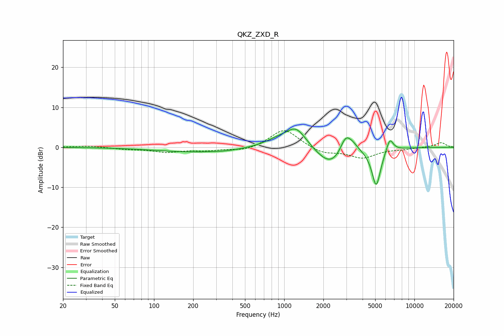

# QKZ_ZXD_R
See [usage instructions](https://github.com/jaakkopasanen/AutoEq#usage) for more options and info.

### Parametric EQs
Apply preamp of -4.7 dB when using parametric equalizer.

|   # | Type    |   Fc (Hz) |    Q |   Gain (dB) |
|-----|---------|-----------|------|-------------|
|   1 | Peaking |       197 | 0.48 |        -1.1 |
|   2 | Peaking |       361 | 1.26 |        -0.3 |
|   3 | Peaking |       883 | 1.39 |         1.5 |
|   4 | Peaking |      1234 | 1.78 |         4.8 |
|   5 | Peaking |      2163 | 1.39 |        -3.7 |
|   6 | Peaking |      2469 | 2.07 |        -1.2 |
|   7 | Peaking |      2956 | 3.45 |         4   |
|   8 | Peaking |      3340 | 3.29 |         1.6 |
|   9 | Peaking |      5089 | 4.01 |        -9.7 |
|  10 | Peaking |      6469 | 5.11 |         3.4 |

### Fixed Band EQs
When using fixed band (also called graphic) equalizer, apply preamp of **-4.2 dB** (if available) and set gains manually with these parameters.

|   # | Type    |   Fc (Hz) |    Q |   Gain (dB) |
|-----|---------|-----------|------|-------------|
|   1 | Peaking |        31 | 1.41 |         0.4 |
|   2 | Peaking |        62 | 1.41 |        -0.4 |
|   3 | Peaking |       125 | 1.41 |        -1.1 |
|   4 | Peaking |       250 | 1.41 |        -0.7 |
|   5 | Peaking |       500 | 1.41 |        -1   |
|   6 | Peaking |      1000 | 1.41 |         4.7 |
|   7 | Peaking |      2000 | 1.41 |        -1.6 |
|   8 | Peaking |      4000 | 1.41 |        -2.5 |
|   9 | Peaking |      8000 | 1.41 |        -0.4 |
|  10 | Peaking |     16000 | 1.41 |         1.2 |

### Graphs

