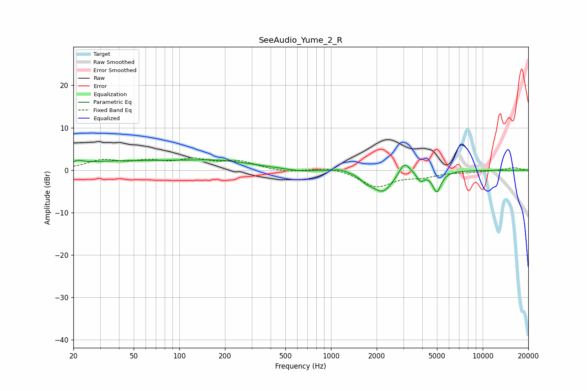

# SeeAudio_Yume_2_R
See [usage instructions](https://github.com/jaakkopasanen/AutoEq#usage) for more options and info.

### Parametric EQs
Apply preamp of -2.5 dB when using parametric equalizer.

|   # | Type    |   Fc (Hz) |    Q |   Gain (dB) |
|-----|---------|-----------|------|-------------|
|   1 | Peaking |        22 | 5.95 |         0.5 |
|   2 | Peaking |        51 | 0.21 |         2.1 |
|   3 | Peaking |       197 | 0.75 |         1   |
|   4 | Peaking |       625 | 1.57 |        -0.5 |
|   5 | Peaking |      1152 | 2.95 |         0.6 |
|   6 | Peaking |      1715 | 3.95 |        -1.1 |
|   7 | Peaking |      2189 | 2    |        -5.1 |
|   8 | Peaking |      3050 | 3.89 |         3.3 |
|   9 | Peaking |      3896 | 6    |        -2   |
|  10 | Peaking |      4988 | 4.97 |        -4.8 |

### Fixed Band EQs
When using fixed band (also called graphic) equalizer, apply preamp of **-3.0 dB** (if available) and set gains manually with these parameters.

|   # | Type    |   Fc (Hz) |    Q |   Gain (dB) |
|-----|---------|-----------|------|-------------|
|   1 | Peaking |        31 | 1.41 |         2.1 |
|   2 | Peaking |        62 | 1.41 |         1.7 |
|   3 | Peaking |       125 | 1.41 |         2.1 |
|   4 | Peaking |       250 | 1.41 |         1.9 |
|   5 | Peaking |       500 | 1.41 |        -0.5 |
|   6 | Peaking |      1000 | 1.41 |         0.9 |
|   7 | Peaking |      2000 | 1.41 |        -3.9 |
|   8 | Peaking |      4000 | 1.41 |        -1.3 |
|   9 | Peaking |      8000 | 1.41 |        -0.4 |
|  10 | Peaking |     16000 | 1.41 |         0.6 |

### Graphs

