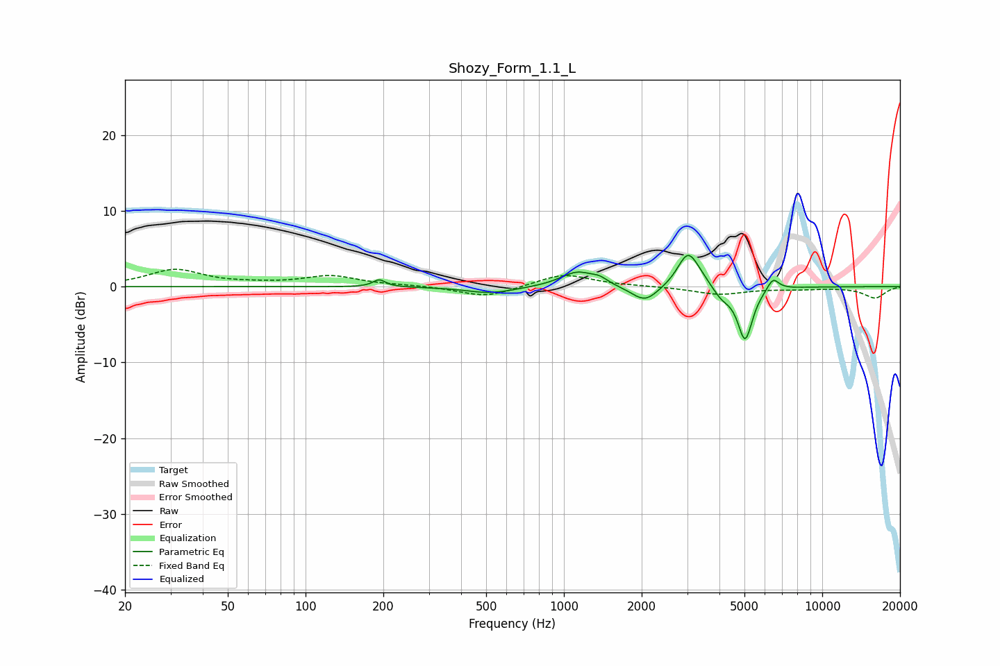

# Shozy_Form_1.1_L
See [usage instructions](https://github.com/jaakkopasanen/AutoEq#usage) for more options and info.

### Parametric EQs
Apply preamp of -4.2 dB when using parametric equalizer.

|   # | Type    |   Fc (Hz) |    Q |   Gain (dB) |
|-----|---------|-----------|------|-------------|
|   1 | Peaking |       193 | 5.96 |         0.9 |
|   2 | Peaking |       522 | 1.49 |        -0.9 |
|   3 | Peaking |      1129 | 2.16 |         2   |
|   4 | Peaking |      1374 | 4.71 |         0.6 |
|   5 | Peaking |      2060 | 2.71 |        -2.2 |
|   6 | Peaking |      3011 | 3.6  |         4.1 |
|   7 | Peaking |      3293 | 2.88 |         1   |
|   8 | Peaking |      4083 | 3.74 |        -1.4 |
|   9 | Peaking |      5029 | 4.85 |        -7   |
|  10 | Peaking |      6446 | 6    |         1.6 |

### Fixed Band EQs
When using fixed band (also called graphic) equalizer, apply preamp of **-2.4 dB** (if available) and set gains manually with these parameters.

|   # | Type    |   Fc (Hz) |    Q |   Gain (dB) |
|-----|---------|-----------|------|-------------|
|   1 | Peaking |        31 | 1.41 |         2.2 |
|   2 | Peaking |        62 | 1.41 |         0.2 |
|   3 | Peaking |       125 | 1.41 |         1.4 |
|   4 | Peaking |       250 | 1.41 |         0.1 |
|   5 | Peaking |       500 | 1.41 |        -1.4 |
|   6 | Peaking |      1000 | 1.41 |         1.7 |
|   7 | Peaking |      2000 | 1.41 |         0.1 |
|   8 | Peaking |      4000 | 1.41 |        -1   |
|   9 | Peaking |      8000 | 1.41 |        -0.3 |
|  10 | Peaking |     16000 | 1.41 |        -1.5 |

### Graphs

