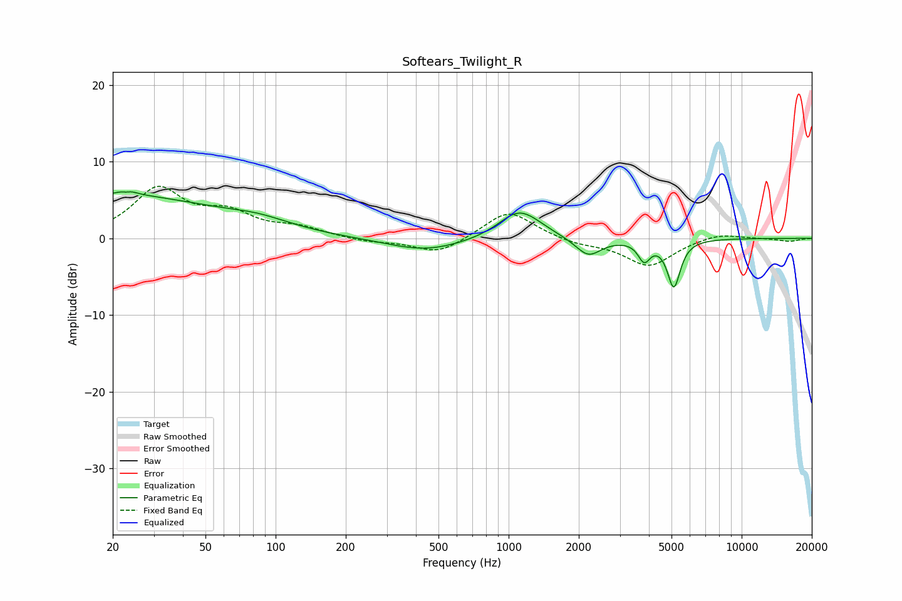

# Softears_Twilight_R
See [usage instructions](https://github.com/jaakkopasanen/AutoEq#usage) for more options and info.

### Parametric EQs
Apply preamp of -6.2 dB when using parametric equalizer.

|   # | Type    |   Fc (Hz) |    Q |   Gain (dB) |
|-----|---------|-----------|------|-------------|
|   1 | Peaking |        20 | 0.31 |         5.6 |
|   2 | Peaking |        23 | 5.97 |        -2.9 |
|   3 | Peaking |        23 | 5.33 |         3.3 |
|   4 | Peaking |        85 | 1.02 |         1.1 |
|   5 | Peaking |       440 | 0.86 |        -1.7 |
|   6 | Peaking |      1093 | 1.66 |         3.3 |
|   7 | Peaking |      1265 | 1.72 |         0.7 |
|   8 | Peaking |      2198 | 2.56 |        -2.4 |
|   9 | Peaking |      3817 | 5.55 |        -2.5 |
|  10 | Peaking |      5116 | 5.05 |        -6.2 |

### Fixed Band EQs
When using fixed band (also called graphic) equalizer, apply preamp of **-6.9 dB** (if available) and set gains manually with these parameters.

|   # | Type    |   Fc (Hz) |    Q |   Gain (dB) |
|-----|---------|-----------|------|-------------|
|   1 | Peaking |        31 | 1.41 |         6.2 |
|   2 | Peaking |        62 | 1.41 |         2.8 |
|   3 | Peaking |       125 | 1.41 |         1.2 |
|   4 | Peaking |       250 | 1.41 |        -0.5 |
|   5 | Peaking |       500 | 1.41 |        -2.1 |
|   6 | Peaking |      1000 | 1.41 |         3.7 |
|   7 | Peaking |      2000 | 1.41 |        -0.7 |
|   8 | Peaking |      4000 | 1.41 |        -3.6 |
|   9 | Peaking |      8000 | 1.41 |         0.8 |
|  10 | Peaking |     16000 | 1.41 |        -0.4 |

### Graphs

