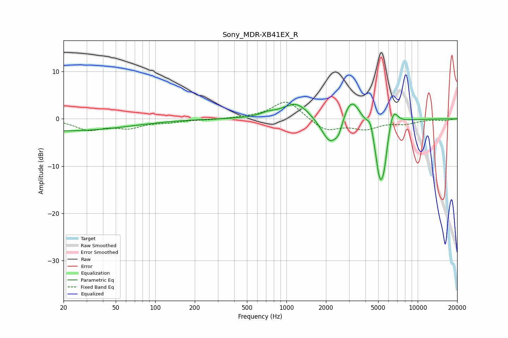

# Sony_MDR-XB41EX_R
See [usage instructions](https://github.com/jaakkopasanen/AutoEq#usage) for more options and info.

### Parametric EQs
Apply preamp of -3.2 dB when using parametric equalizer.

|   # | Type    |   Fc (Hz) |    Q |   Gain (dB) |
|-----|---------|-----------|------|-------------|
|   1 | Peaking |        20 | 0.28 |        -2.5 |
|   2 | Peaking |       725 | 2.38 |         0.7 |
|   3 | Peaking |      1188 | 1.41 |         3.5 |
|   4 | Peaking |      2147 | 2.16 |        -5.9 |
|   5 | Peaking |      2499 | 4.88 |        -2.2 |
|   6 | Peaking |      3118 | 2.21 |         5.5 |
|   7 | Peaking |      4365 | 6    |         2.5 |
|   8 | Peaking |      5147 | 3.56 |       -12.2 |
|   9 | Peaking |      5553 | 5.84 |        -4.4 |
|  10 | Peaking |      6493 | 3.91 |         4.2 |

### Fixed Band EQs
When using fixed band (also called graphic) equalizer, apply preamp of **-3.6 dB** (if available) and set gains manually with these parameters.

|   # | Type    |   Fc (Hz) |    Q |   Gain (dB) |
|-----|---------|-----------|------|-------------|
|   1 | Peaking |        31 | 1.41 |        -2.2 |
|   2 | Peaking |        62 | 1.41 |        -1.7 |
|   3 | Peaking |       125 | 1.41 |        -0.6 |
|   4 | Peaking |       250 | 1.41 |        -0.2 |
|   5 | Peaking |       500 | 1.41 |         0.1 |
|   6 | Peaking |      1000 | 1.41 |         4   |
|   7 | Peaking |      2000 | 1.41 |        -2.6 |
|   8 | Peaking |      4000 | 1.41 |        -1.9 |
|   9 | Peaking |      8000 | 1.41 |        -0.9 |
|  10 | Peaking |     16000 | 1.41 |        -0.3 |

### Graphs

