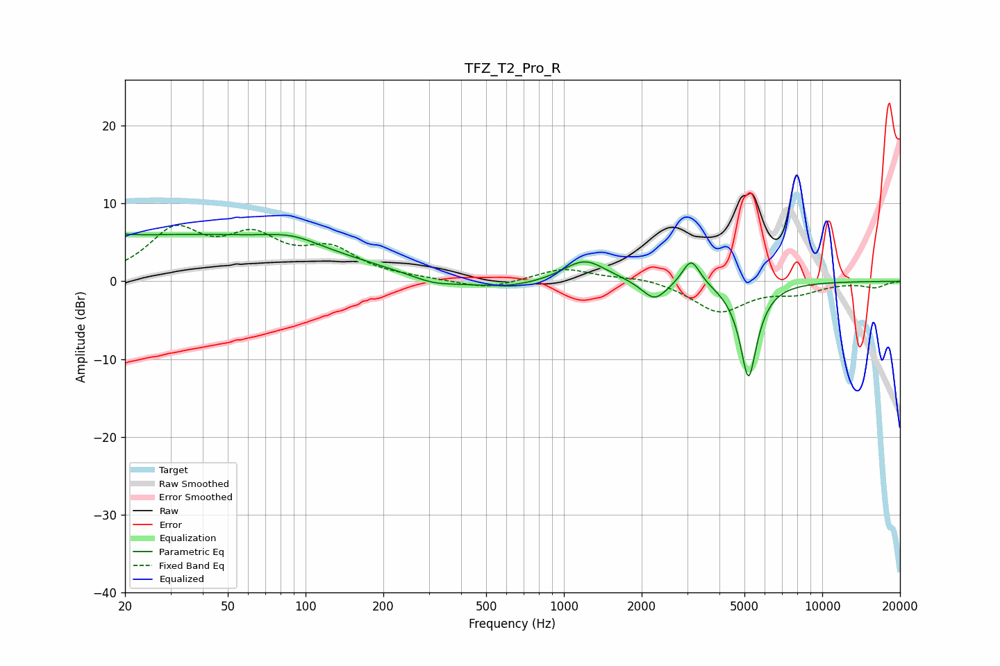

# TFZ_T2_Pro_R
See [usage instructions](https://github.com/jaakkopasanen/AutoEq#usage) for more options and info.

### Parametric EQs
Apply preamp of -6.2 dB when using parametric equalizer.

|   # | Type    |   Fc (Hz) |    Q |   Gain (dB) |
|-----|---------|-----------|------|-------------|
|   1 | Peaking |        20 | 5.53 |         3.5 |
|   2 | Peaking |        20 | 5.92 |        -3.1 |
|   3 | Peaking |        32 | 0.22 |         5.9 |
|   4 | Peaking |        89 | 1.33 |         1.3 |
|   5 | Peaking |       313 | 1.53 |        -1   |
|   6 | Peaking |       590 | 0.94 |        -1.1 |
|   7 | Peaking |      1202 | 1.69 |         2.9 |
|   8 | Peaking |      2243 | 2.9  |        -2.6 |
|   9 | Peaking |      3111 | 4.12 |         3.4 |
|  10 | Peaking |      5184 | 4.05 |       -12.3 |

### Fixed Band EQs
When using fixed band (also called graphic) equalizer, apply preamp of **-7.3 dB** (if available) and set gains manually with these parameters.

|   # | Type    |   Fc (Hz) |    Q |   Gain (dB) |
|-----|---------|-----------|------|-------------|
|   1 | Peaking |        31 | 1.41 |         6.1 |
|   2 | Peaking |        62 | 1.41 |         4.8 |
|   3 | Peaking |       125 | 1.41 |         3.6 |
|   4 | Peaking |       250 | 1.41 |         0.2 |
|   5 | Peaking |       500 | 1.41 |        -1.1 |
|   6 | Peaking |      1000 | 1.41 |         1.7 |
|   7 | Peaking |      2000 | 1.41 |         0.6 |
|   8 | Peaking |      4000 | 1.41 |        -3.9 |
|   9 | Peaking |      8000 | 1.41 |        -1.3 |
|  10 | Peaking |     16000 | 1.41 |        -0.7 |

### Graphs

