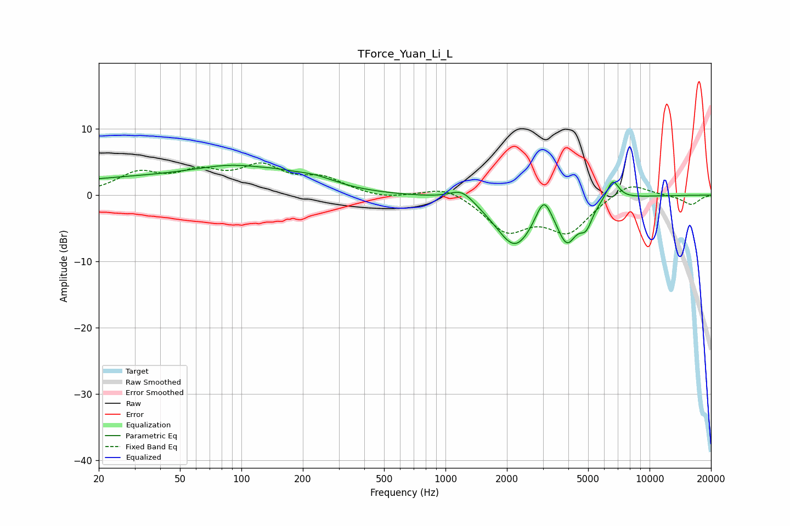

# TForce_Yuan_Li_L
See [usage instructions](https://github.com/jaakkopasanen/AutoEq#usage) for more options and info.

### Parametric EQs
Apply preamp of -4.6 dB when using parametric equalizer.

|   # | Type    |   Fc (Hz) |    Q |   Gain (dB) |
|-----|---------|-----------|------|-------------|
|   1 | Peaking |        33 | 0.27 |         2.4 |
|   2 | Peaking |        95 | 0.72 |         2.4 |
|   3 | Peaking |       147 | 1.84 |         0.4 |
|   4 | Peaking |       223 | 1.13 |         1.6 |
|   5 | Peaking |      1206 | 2.33 |         2   |
|   6 | Peaking |      2191 | 1.46 |        -7.7 |
|   7 | Peaking |      3031 | 3.7  |         4.1 |
|   8 | Peaking |      3934 | 2.9  |        -5.8 |
|   9 | Peaking |      4886 | 4.47 |        -2.9 |
|  10 | Peaking |      6600 | 4.53 |         3.1 |

### Fixed Band EQs
When using fixed band (also called graphic) equalizer, apply preamp of **-4.9 dB** (if available) and set gains manually with these parameters.

|   # | Type    |   Fc (Hz) |    Q |   Gain (dB) |
|-----|---------|-----------|------|-------------|
|   1 | Peaking |        31 | 1.41 |         3   |
|   2 | Peaking |        62 | 1.41 |         2.9 |
|   3 | Peaking |       125 | 1.41 |         3.8 |
|   4 | Peaking |       250 | 1.41 |         2.2 |
|   5 | Peaking |       500 | 1.41 |        -0.6 |
|   6 | Peaking |      1000 | 1.41 |         1.6 |
|   7 | Peaking |      2000 | 1.41 |        -5.1 |
|   8 | Peaking |      4000 | 1.41 |        -5.2 |
|   9 | Peaking |      8000 | 1.41 |         2.2 |
|  10 | Peaking |     16000 | 1.41 |        -1.4 |

### Graphs

