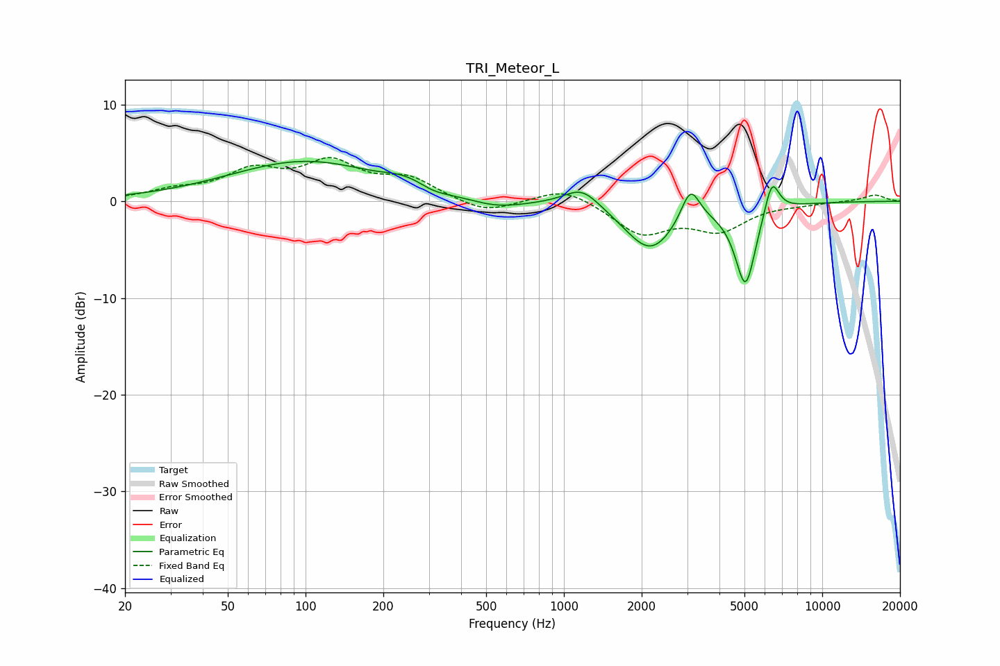

# TRI_Meteor_L
See [usage instructions](https://github.com/jaakkopasanen/AutoEq#usage) for more options and info.

### Parametric EQs
Apply preamp of -4.2 dB when using parametric equalizer.

|   # | Type    |   Fc (Hz) |    Q |   Gain (dB) |
|-----|---------|-----------|------|-------------|
|   1 | Peaking |       100 | 0.48 |         4.1 |
|   2 | Peaking |       224 | 2.56 |         0.4 |
|   3 | Peaking |       262 | 2.51 |         0.5 |
|   4 | Peaking |       312 | 2.35 |        -0.4 |
|   5 | Peaking |       549 | 1.28 |        -0.9 |
|   6 | Peaking |      1175 | 2.04 |         2.1 |
|   7 | Peaking |      2162 | 1.42 |        -5.1 |
|   8 | Peaking |      3090 | 3.87 |         3.6 |
|   9 | Peaking |      5047 | 3.42 |        -8.5 |
|  10 | Peaking |      6380 | 4.78 |         3.7 |

### Fixed Band EQs
When using fixed band (also called graphic) equalizer, apply preamp of **-4.6 dB** (if available) and set gains manually with these parameters.

|   # | Type    |   Fc (Hz) |    Q |   Gain (dB) |
|-----|---------|-----------|------|-------------|
|   1 | Peaking |        31 | 1.41 |         0.9 |
|   2 | Peaking |        62 | 1.41 |         2.8 |
|   3 | Peaking |       125 | 1.41 |         3.6 |
|   4 | Peaking |       250 | 1.41 |         2.1 |
|   5 | Peaking |       500 | 1.41 |        -1.3 |
|   6 | Peaking |      1000 | 1.41 |         1.5 |
|   7 | Peaking |      2000 | 1.41 |        -3.2 |
|   8 | Peaking |      4000 | 1.41 |        -2.8 |
|   9 | Peaking |      8000 | 1.41 |        -0.2 |
|  10 | Peaking |     16000 | 1.41 |         0.7 |

### Graphs

