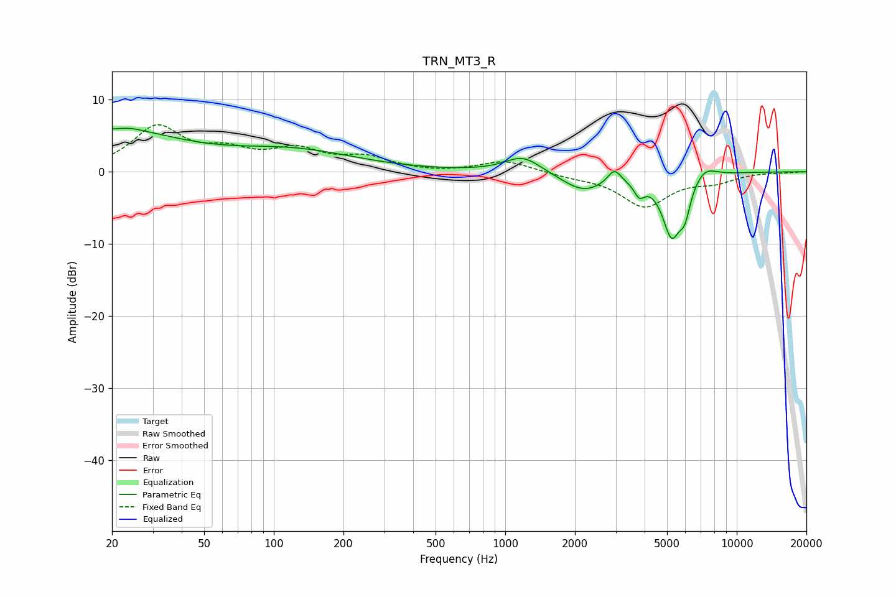

# TRN_MT3_R
See [usage instructions](https://github.com/jaakkopasanen/AutoEq#usage) for more options and info.

### Parametric EQs
Apply preamp of -6.1 dB when using parametric equalizer.

|   # | Type    |   Fc (Hz) |    Q |   Gain (dB) |
|-----|---------|-----------|------|-------------|
|   1 | Peaking |        20 | 0.48 |         5.6 |
|   2 | Peaking |        24 | 3.2  |         0.2 |
|   3 | Peaking |       123 | 0.53 |         2.7 |
|   4 | Peaking |      1192 | 1.83 |         2.3 |
|   5 | Peaking |      2178 | 1.51 |        -2.6 |
|   6 | Peaking |      2961 | 5.05 |         1.9 |
|   7 | Peaking |      3795 | 6    |        -2   |
|   8 | Peaking |      5235 | 3.33 |        -8.3 |
|   9 | Peaking |      5967 | 5.83 |        -3.4 |
|  10 | Peaking |      7291 | 2.85 |         1.5 |

### Fixed Band EQs
When using fixed band (also called graphic) equalizer, apply preamp of **-6.6 dB** (if available) and set gains manually with these parameters.

|   # | Type    |   Fc (Hz) |    Q |   Gain (dB) |
|-----|---------|-----------|------|-------------|
|   1 | Peaking |        31 | 1.41 |         6   |
|   2 | Peaking |        62 | 1.41 |         2.3 |
|   3 | Peaking |       125 | 1.41 |         2.7 |
|   4 | Peaking |       250 | 1.41 |         1.8 |
|   5 | Peaking |       500 | 1.41 |        -0.2 |
|   6 | Peaking |      1000 | 1.41 |         1.6 |
|   7 | Peaking |      2000 | 1.41 |        -0.5 |
|   8 | Peaking |      4000 | 1.41 |        -4.7 |
|   9 | Peaking |      8000 | 1.41 |        -1.2 |
|  10 | Peaking |     16000 | 1.41 |        -0.1 |

### Graphs

