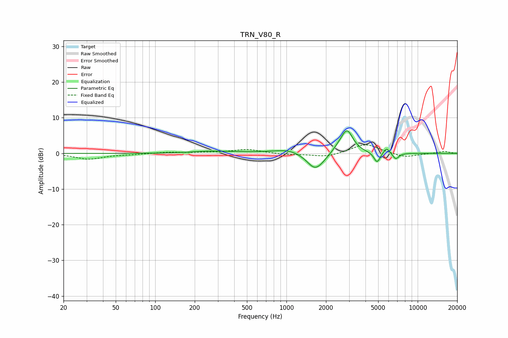

# TRN_V80_R
See [usage instructions](https://github.com/jaakkopasanen/AutoEq#usage) for more options and info.

### Parametric EQs
Apply preamp of -6.4 dB when using parametric equalizer.

|   # | Type    |   Fc (Hz) |    Q |   Gain (dB) |
|-----|---------|-----------|------|-------------|
|   1 | Peaking |       259 | 1.07 |         0.5 |
|   2 | Peaking |       466 | 0.95 |         0.2 |
|   3 | Peaking |      1034 | 1.3  |         1.2 |
|   4 | Peaking |      1648 | 2.25 |        -4.3 |
|   5 | Peaking |      1875 | 1.9  |        -0.9 |
|   6 | Peaking |      2512 | 2.39 |         1.3 |
|   7 | Peaking |      2898 | 3.09 |         6.1 |
|   8 | Peaking |      4904 | 5.91 |        -2.9 |
|   9 | Peaking |      5787 | 6    |         1.7 |
|  10 | Peaking |      6810 | 5.95 |        -1.7 |

### Fixed Band EQs
When using fixed band (also called graphic) equalizer, apply preamp of **-2.5 dB** (if available) and set gains manually with these parameters.

|   # | Type    |   Fc (Hz) |    Q |   Gain (dB) |
|-----|---------|-----------|------|-------------|
|   1 | Peaking |        31 | 1.41 |        -1.6 |
|   2 | Peaking |        62 | 1.41 |        -0.2 |
|   3 | Peaking |       125 | 1.41 |         0.3 |
|   4 | Peaking |       250 | 1.41 |         0.2 |
|   5 | Peaking |       500 | 1.41 |         1.1 |
|   6 | Peaking |      1000 | 1.41 |        -0.3 |
|   7 | Peaking |      2000 | 1.41 |        -1.1 |
|   8 | Peaking |      4000 | 1.41 |         2.7 |
|   9 | Peaking |      8000 | 1.41 |        -1.2 |
|  10 | Peaking |     16000 | 1.41 |         0.6 |

### Graphs

