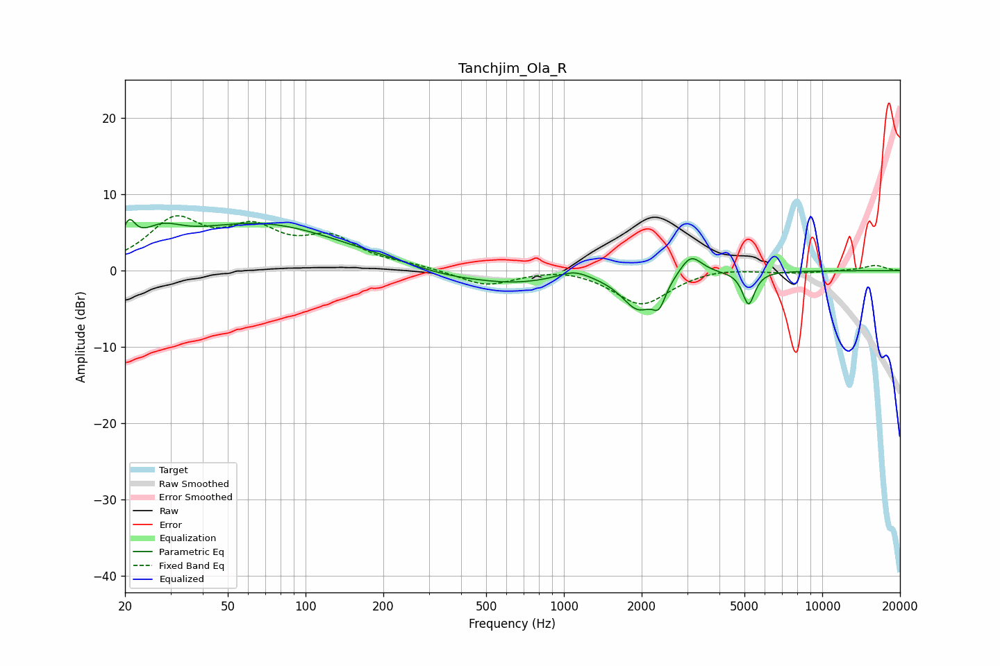

# Tanchjim_Ola_R
See [usage instructions](https://github.com/jaakkopasanen/AutoEq#usage) for more options and info.

### Parametric EQs
Apply preamp of -6.8 dB when using parametric equalizer.

|   # | Type    |   Fc (Hz) |    Q |   Gain (dB) |
|-----|---------|-----------|------|-------------|
|   1 | Peaking |        21 | 5.93 |         3.2 |
|   2 | Peaking |        28 | 1.85 |         2.5 |
|   3 | Peaking |        66 | 0.43 |         6   |
|   4 | Peaking |       354 | 0.98 |        -0.9 |
|   5 | Peaking |       642 | 0.85 |        -1.5 |
|   6 | Peaking |      1096 | 2.42 |         1.1 |
|   7 | Peaking |      1940 | 2.17 |        -4.7 |
|   8 | Peaking |      2336 | 5.71 |        -2.7 |
|   9 | Peaking |      3096 | 3.28 |         2.8 |
|  10 | Peaking |      5187 | 6    |        -4.4 |

### Fixed Band EQs
When using fixed band (also called graphic) equalizer, apply preamp of **-7.3 dB** (if available) and set gains manually with these parameters.

|   # | Type    |   Fc (Hz) |    Q |   Gain (dB) |
|-----|---------|-----------|------|-------------|
|   1 | Peaking |        31 | 1.41 |         6.2 |
|   2 | Peaking |        62 | 1.41 |         4.6 |
|   3 | Peaking |       125 | 1.41 |         3.8 |
|   4 | Peaking |       250 | 1.41 |         0.5 |
|   5 | Peaking |       500 | 1.41 |        -2   |
|   6 | Peaking |      1000 | 1.41 |         0.6 |
|   7 | Peaking |      2000 | 1.41 |        -4.5 |
|   8 | Peaking |      4000 | 1.41 |         0.5 |
|   9 | Peaking |      8000 | 1.41 |        -0.3 |
|  10 | Peaking |     16000 | 1.41 |         0.7 |

### Graphs

