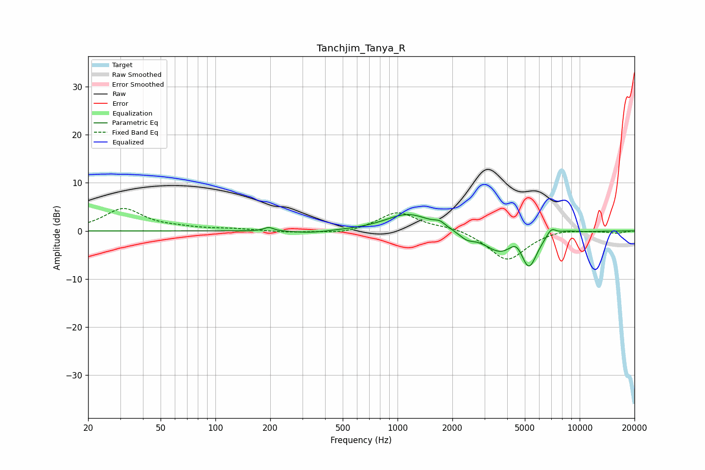

# Tanchjim_Tanya_R
See [usage instructions](https://github.com/jaakkopasanen/AutoEq#usage) for more options and info.

### Parametric EQs
Apply preamp of -3.5 dB when using parametric equalizer.

|   # | Type    |   Fc (Hz) |    Q |   Gain (dB) |
|-----|---------|-----------|------|-------------|
|   1 | Peaking |       196 | 5.6  |         0.8 |
|   2 | Peaking |       336 | 1.37 |        -0.5 |
|   3 | Peaking |      1144 | 1.15 |         3.6 |
|   4 | Peaking |      1707 | 4.65 |         0.9 |
|   5 | Peaking |      2398 | 3.37 |        -1.3 |
|   6 | Peaking |      3632 | 1.63 |        -4   |
|   7 | Peaking |      4505 | 3.72 |         2.3 |
|   8 | Peaking |      5258 | 3.04 |        -7.1 |
|   9 | Peaking |      6977 | 4.82 |         1.8 |
|  10 | Peaking |      8518 | 2.61 |         0.4 |

### Fixed Band EQs
When using fixed band (also called graphic) equalizer, apply preamp of **-4.7 dB** (if available) and set gains manually with these parameters.

|   # | Type    |   Fc (Hz) |    Q |   Gain (dB) |
|-----|---------|-----------|------|-------------|
|   1 | Peaking |        31 | 1.41 |         4.6 |
|   2 | Peaking |        62 | 1.41 |         0.4 |
|   3 | Peaking |       125 | 1.41 |         0.4 |
|   4 | Peaking |       250 | 1.41 |        -0.3 |
|   5 | Peaking |       500 | 1.41 |        -0.7 |
|   6 | Peaking |      1000 | 1.41 |         3.9 |
|   7 | Peaking |      2000 | 1.41 |         0.8 |
|   8 | Peaking |      4000 | 1.41 |        -6.2 |
|   9 | Peaking |      8000 | 1.41 |         0.6 |
|  10 | Peaking |     16000 | 1.41 |        -0.5 |

### Graphs

