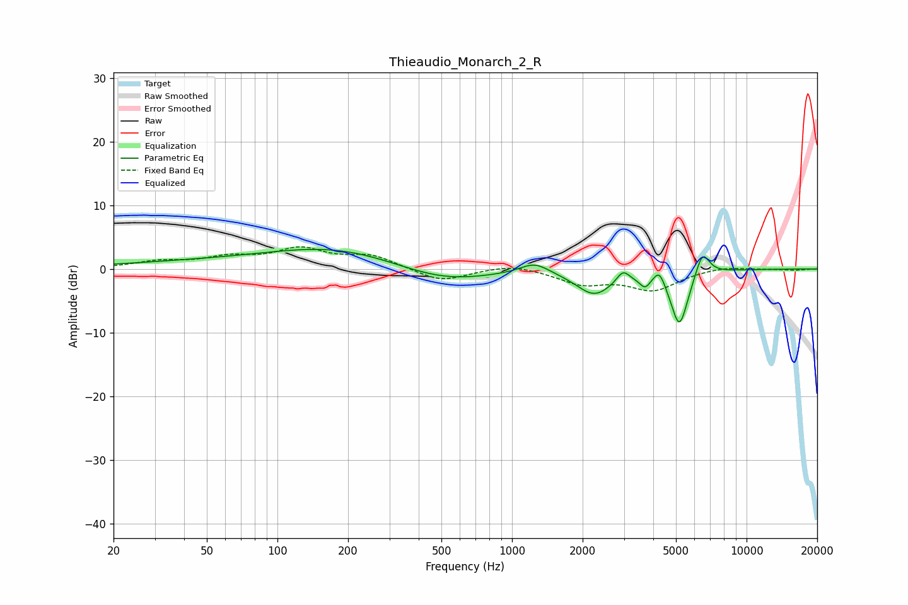

# Thieaudio_Monarch_2_R
See [usage instructions](https://github.com/jaakkopasanen/AutoEq#usage) for more options and info.

### Parametric EQs
Apply preamp of -3.2 dB when using parametric equalizer.

|   # | Type    |   Fc (Hz) |    Q |   Gain (dB) |
|-----|---------|-----------|------|-------------|
|   1 | Peaking |       119 | 0.18 |         1.4 |
|   2 | Peaking |       175 | 0.54 |         2.2 |
|   3 | Peaking |       507 | 0.68 |        -2.8 |
|   4 | Peaking |      1248 | 2.31 |         1.7 |
|   5 | Peaking |      2244 | 1.8  |        -3.9 |
|   6 | Peaking |      2970 | 5.49 |         1.7 |
|   7 | Peaking |      3687 | 6    |        -1.7 |
|   8 | Peaking |      4248 | 5.77 |         2.3 |
|   9 | Peaking |      5171 | 3.65 |        -9   |
|  10 | Peaking |      6480 | 4.59 |         4.1 |

### Fixed Band EQs
When using fixed band (also called graphic) equalizer, apply preamp of **-3.6 dB** (if available) and set gains manually with these parameters.

|   # | Type    |   Fc (Hz) |    Q |   Gain (dB) |
|-----|---------|-----------|------|-------------|
|   1 | Peaking |        31 | 1.41 |         1   |
|   2 | Peaking |        62 | 1.41 |         1.5 |
|   3 | Peaking |       125 | 1.41 |         2.9 |
|   4 | Peaking |       250 | 1.41 |         2   |
|   5 | Peaking |       500 | 1.41 |        -2.1 |
|   6 | Peaking |      1000 | 1.41 |         0.9 |
|   7 | Peaking |      2000 | 1.41 |        -2.2 |
|   8 | Peaking |      4000 | 1.41 |        -3.2 |
|   9 | Peaking |      8000 | 1.41 |         0.5 |
|  10 | Peaking |     16000 | 1.41 |        -0.2 |

### Graphs

