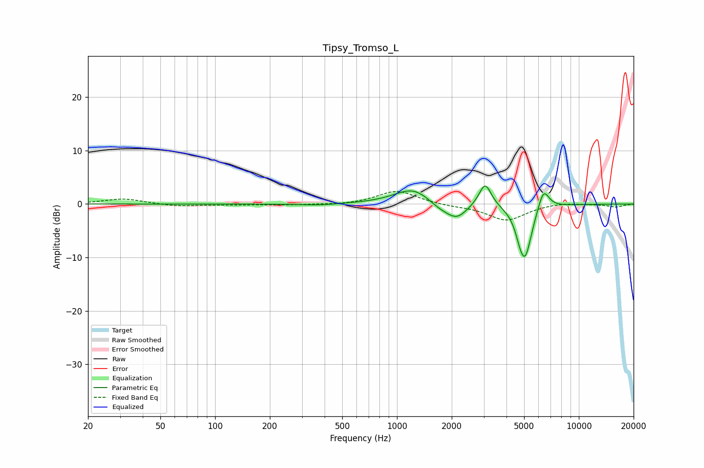

# Tipsy_Tromso_L
See [usage instructions](https://github.com/jaakkopasanen/AutoEq#usage) for more options and info.

### Parametric EQs
Apply preamp of -3.5 dB when using parametric equalizer.

|   # | Type    |   Fc (Hz) |    Q |   Gain (dB) |
|-----|---------|-----------|------|-------------|
|   1 | Peaking |       370 | 1.37 |        -0.3 |
|   2 | Peaking |      1230 | 1.43 |         2.5 |
|   3 | Peaking |      1292 | 1.06 |         0.6 |
|   4 | Peaking |      1706 | 2.09 |        -0.8 |
|   5 | Peaking |      1715 | 1.96 |        -0.6 |
|   6 | Peaking |      2131 | 2.42 |        -2.7 |
|   7 | Peaking |      3052 | 4.15 |         4.4 |
|   8 | Peaking |      4743 | 5.9  |        -1.7 |
|   9 | Peaking |      5073 | 3.64 |        -9.6 |
|  10 | Peaking |      6388 | 4.42 |         4.1 |

### Fixed Band EQs
When using fixed band (also called graphic) equalizer, apply preamp of **-2.4 dB** (if available) and set gains manually with these parameters.

|   # | Type    |   Fc (Hz) |    Q |   Gain (dB) |
|-----|---------|-----------|------|-------------|
|   1 | Peaking |        31 | 1.41 |         1   |
|   2 | Peaking |        62 | 1.41 |        -0.4 |
|   3 | Peaking |       125 | 1.41 |        -0.1 |
|   4 | Peaking |       250 | 1.41 |        -0.2 |
|   5 | Peaking |       500 | 1.41 |        -0.2 |
|   6 | Peaking |      1000 | 1.41 |         2.5 |
|   7 | Peaking |      2000 | 1.41 |        -0.3 |
|   8 | Peaking |      4000 | 1.41 |        -3.1 |
|   9 | Peaking |      8000 | 1.41 |         0.4 |
|  10 | Peaking |     16000 | 1.41 |        -0.6 |

### Graphs

