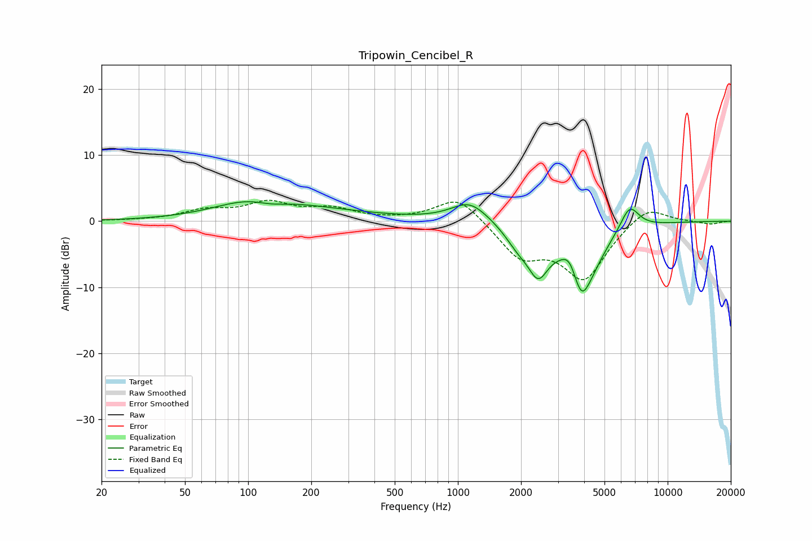

# Tripowin_Cencibel_R
See [usage instructions](https://github.com/jaakkopasanen/AutoEq#usage) for more options and info.

### Parametric EQs
Apply preamp of -3.0 dB when using parametric equalizer.

|   # | Type    |   Fc (Hz) |    Q |   Gain (dB) |
|-----|---------|-----------|------|-------------|
|   1 | Peaking |       110 | 0.78 |         3   |
|   2 | Peaking |       128 | 1.64 |        -1.1 |
|   3 | Peaking |       226 | 0.48 |         1.2 |
|   4 | Peaking |      1141 | 1.6  |         3.1 |
|   5 | Peaking |      1939 | 2.21 |        -2.5 |
|   6 | Peaking |      2414 | 2.85 |        -5.8 |
|   7 | Peaking |      3425 | 3.61 |         3.3 |
|   8 | Peaking |      3933 | 2.09 |       -13   |
|   9 | Peaking |      4091 | 4.18 |         1.4 |
|  10 | Peaking |      6583 | 3.01 |         3.9 |

### Fixed Band EQs
When using fixed band (also called graphic) equalizer, apply preamp of **-3.2 dB** (if available) and set gains manually with these parameters.

|   # | Type    |   Fc (Hz) |    Q |   Gain (dB) |
|-----|---------|-----------|------|-------------|
|   1 | Peaking |        31 | 1.41 |         0.1 |
|   2 | Peaking |        62 | 1.41 |         1.5 |
|   3 | Peaking |       125 | 1.41 |         2.6 |
|   4 | Peaking |       250 | 1.41 |         1.7 |
|   5 | Peaking |       500 | 1.41 |         0.1 |
|   6 | Peaking |      1000 | 1.41 |         3.9 |
|   7 | Peaking |      2000 | 1.41 |        -5.1 |
|   8 | Peaking |      4000 | 1.41 |        -8.5 |
|   9 | Peaking |      8000 | 1.41 |         2.7 |
|  10 | Peaking |     16000 | 1.41 |        -0.5 |

### Graphs

