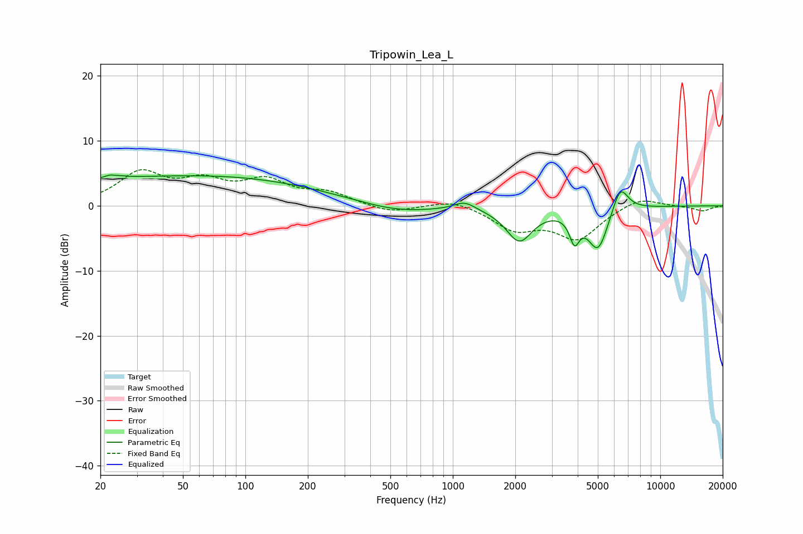

# Tripowin_Lea_L
See [usage instructions](https://github.com/jaakkopasanen/AutoEq#usage) for more options and info.

### Parametric EQs
Apply preamp of -4.8 dB when using parametric equalizer.

|   # | Type    |   Fc (Hz) |    Q |   Gain (dB) |
|-----|---------|-----------|------|-------------|
|   1 | Peaking |        23 | 5.43 |         3.4 |
|   2 | Peaking |        23 | 6    |        -2.9 |
|   3 | Peaking |        40 | 0.19 |         4.3 |
|   4 | Peaking |       197 | 0.29 |         0.8 |
|   5 | Peaking |       535 | 0.75 |        -1.5 |
|   6 | Peaking |      1140 | 2.79 |         1.3 |
|   7 | Peaking |      2093 | 2.21 |        -5.2 |
|   8 | Peaking |      3859 | 5.99 |        -3.9 |
|   9 | Peaking |      5015 | 2.76 |        -6.7 |
|  10 | Peaking |      6407 | 3.52 |         4.3 |

### Fixed Band EQs
When using fixed band (also called graphic) equalizer, apply preamp of **-5.7 dB** (if available) and set gains manually with these parameters.

|   # | Type    |   Fc (Hz) |    Q |   Gain (dB) |
|-----|---------|-----------|------|-------------|
|   1 | Peaking |        31 | 1.41 |         4.8 |
|   2 | Peaking |        62 | 1.41 |         3.2 |
|   3 | Peaking |       125 | 1.41 |         3.5 |
|   4 | Peaking |       250 | 1.41 |         1.8 |
|   5 | Peaking |       500 | 1.41 |        -1.1 |
|   6 | Peaking |      1000 | 1.41 |         1.1 |
|   7 | Peaking |      2000 | 1.41 |        -3.4 |
|   8 | Peaking |      4000 | 1.41 |        -4.9 |
|   9 | Peaking |      8000 | 1.41 |         1.5 |
|  10 | Peaking |     16000 | 1.41 |        -0.8 |

### Graphs

