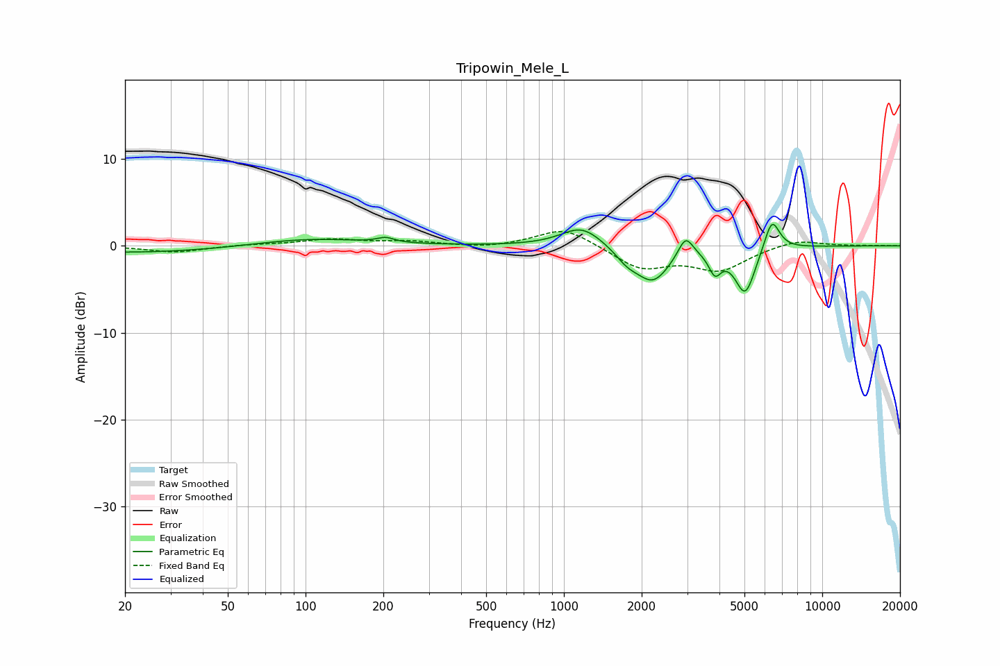

# Tripowin_Mele_L
See [usage instructions](https://github.com/jaakkopasanen/AutoEq#usage) for more options and info.

### Parametric EQs
Apply preamp of -2.6 dB when using parametric equalizer.

|   # | Type    |   Fc (Hz) |    Q |   Gain (dB) |
|-----|---------|-----------|------|-------------|
|   1 | Peaking |        23 | 0.36 |        -0.8 |
|   2 | Peaking |       101 | 0.64 |         0.9 |
|   3 | Peaking |       204 | 4.43 |         0.5 |
|   4 | Peaking |      1172 | 1.79 |         2.4 |
|   5 | Peaking |      1753 | 3.16 |        -1.2 |
|   6 | Peaking |      2208 | 2.12 |        -4   |
|   7 | Peaking |      2959 | 4.87 |         2.5 |
|   8 | Peaking |      3842 | 5.96 |        -2.4 |
|   9 | Peaking |      5032 | 3.52 |        -5.4 |
|  10 | Peaking |      6386 | 4.6  |         3.8 |

### Fixed Band EQs
When using fixed band (also called graphic) equalizer, apply preamp of **-1.7 dB** (if available) and set gains manually with these parameters.

|   # | Type    |   Fc (Hz) |    Q |   Gain (dB) |
|-----|---------|-----------|------|-------------|
|   1 | Peaking |        31 | 1.41 |        -0.7 |
|   2 | Peaking |        62 | 1.41 |         0.1 |
|   3 | Peaking |       125 | 1.41 |         0.7 |
|   4 | Peaking |       250 | 1.41 |         0.5 |
|   5 | Peaking |       500 | 1.41 |        -0.3 |
|   6 | Peaking |      1000 | 1.41 |         2.2 |
|   7 | Peaking |      2000 | 1.41 |        -2.5 |
|   8 | Peaking |      4000 | 1.41 |        -2.7 |
|   9 | Peaking |      8000 | 1.41 |         0.8 |
|  10 | Peaking |     16000 | 1.41 |         0   |

### Graphs

