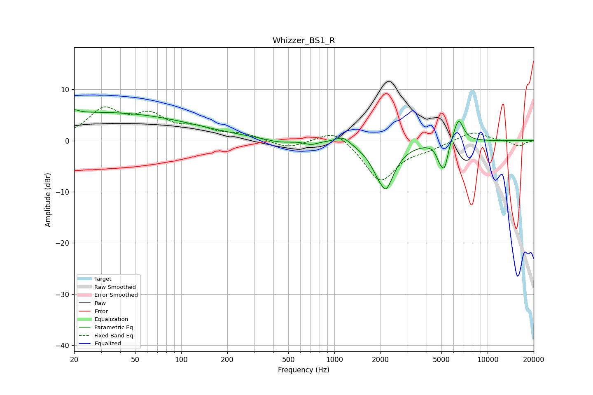

# Whizzer_BS1_R
See [usage instructions](https://github.com/jaakkopasanen/AutoEq#usage) for more options and info.

### Parametric EQs
Apply preamp of -6.1 dB when using parametric equalizer.

|   # | Type    |   Fc (Hz) |    Q |   Gain (dB) |
|-----|---------|-----------|------|-------------|
|   1 | Peaking |        20 | 5    |         0.7 |
|   2 | Peaking |        29 | 0.21 |         5.5 |
|   3 | Peaking |       435 | 1.74 |        -0.6 |
|   4 | Peaking |       702 | 3.47 |        -0.7 |
|   5 | Peaking |      1134 | 2.88 |         1.5 |
|   6 | Peaking |      2053 | 6    |         1.6 |
|   7 | Peaking |      2113 | 2.45 |       -10.8 |
|   8 | Peaking |      4848 | 6    |        -2   |
|   9 | Peaking |      5232 | 5.79 |        -4.8 |
|  10 | Peaking |      6459 | 4.15 |         4.7 |

### Fixed Band EQs
When using fixed band (also called graphic) equalizer, apply preamp of **-6.7 dB** (if available) and set gains manually with these parameters.

|   # | Type    |   Fc (Hz) |    Q |   Gain (dB) |
|-----|---------|-----------|------|-------------|
|   1 | Peaking |        31 | 1.41 |         5.7 |
|   2 | Peaking |        62 | 1.41 |         4.3 |
|   3 | Peaking |       125 | 1.41 |         2   |
|   4 | Peaking |       250 | 1.41 |         1.2 |
|   5 | Peaking |       500 | 1.41 |        -1.5 |
|   6 | Peaking |      1000 | 1.41 |         2.7 |
|   7 | Peaking |      2000 | 1.41 |        -8   |
|   8 | Peaking |      4000 | 1.41 |        -1.2 |
|   9 | Peaking |      8000 | 1.41 |         1.9 |
|  10 | Peaking |     16000 | 1.41 |        -1.1 |

### Graphs

