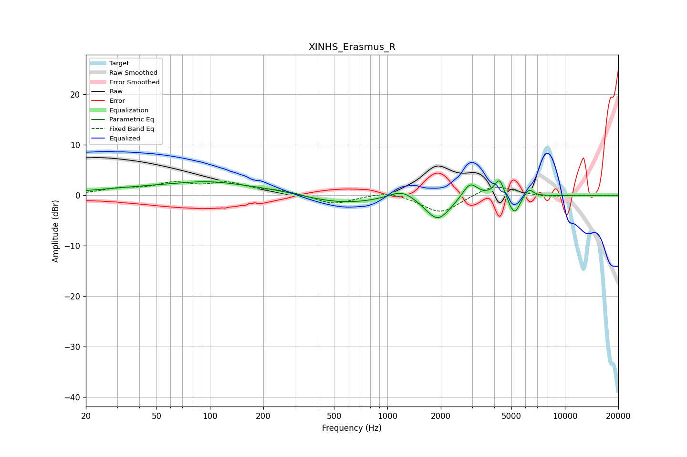

# XINHS_Erasmus_R
See [usage instructions](https://github.com/jaakkopasanen/AutoEq#usage) for more options and info.

### Parametric EQs
Apply preamp of -2.9 dB when using parametric equalizer.

|   # | Type    |   Fc (Hz) |    Q |   Gain (dB) |
|-----|---------|-----------|------|-------------|
|   1 | Peaking |        98 | 1.03 |         0.6 |
|   2 | Peaking |       124 | 0.21 |         2.3 |
|   3 | Peaking |       522 | 0.59 |        -2.7 |
|   4 | Peaking |      1211 | 1.86 |         2.1 |
|   5 | Peaking |      1922 | 1.98 |        -5   |
|   6 | Peaking |      2919 | 3.36 |         3.2 |
|   7 | Peaking |      4278 | 5.18 |         3.6 |
|   8 | Peaking |      4943 | 5.77 |        -1.4 |
|   9 | Peaking |      5266 | 5.43 |        -3   |
|  10 | Peaking |      6289 | 6    |         1.5 |

### Fixed Band EQs
When using fixed band (also called graphic) equalizer, apply preamp of **-2.8 dB** (if available) and set gains manually with these parameters.

|   # | Type    |   Fc (Hz) |    Q |   Gain (dB) |
|-----|---------|-----------|------|-------------|
|   1 | Peaking |        31 | 1.41 |         1.1 |
|   2 | Peaking |        62 | 1.41 |         2.1 |
|   3 | Peaking |       125 | 1.41 |         2.1 |
|   4 | Peaking |       250 | 1.41 |         0.8 |
|   5 | Peaking |       500 | 1.41 |        -1.8 |
|   6 | Peaking |      1000 | 1.41 |         1   |
|   7 | Peaking |      2000 | 1.41 |        -3.7 |
|   8 | Peaking |      4000 | 1.41 |         2.2 |
|   9 | Peaking |      8000 | 1.41 |        -0.4 |
|  10 | Peaking |     16000 | 1.41 |        -0   |

### Graphs

