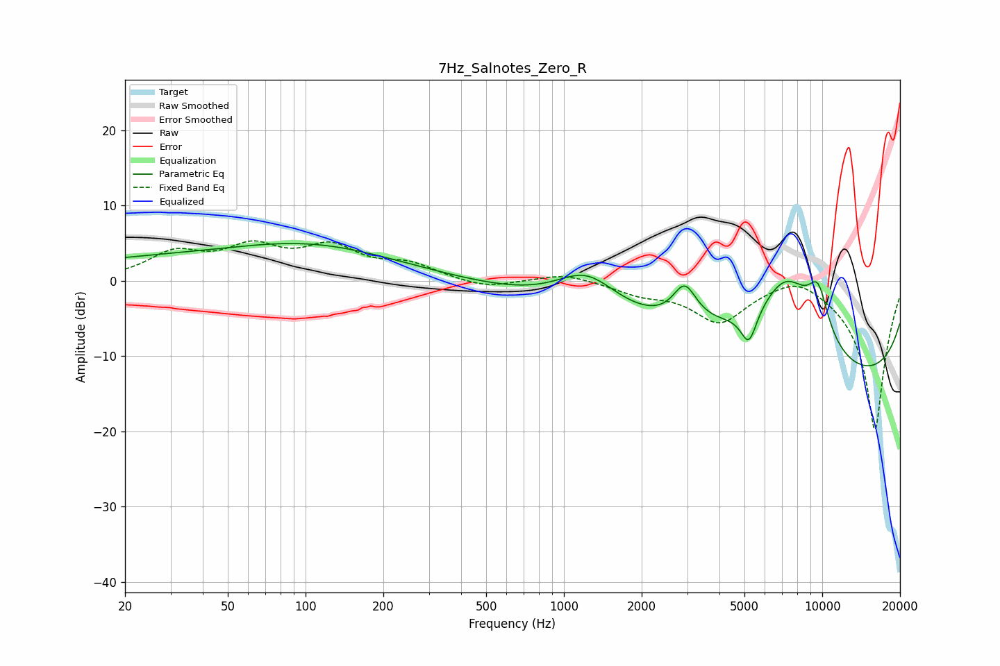

# 7Hz_Salnotes_Zero_R
See [usage instructions](https://github.com/jaakkopasanen/AutoEq#usage) for more options and info.

### Parametric EQs
Apply preamp of -5.0 dB when using parametric equalizer.

|   # | Type    |   Fc (Hz) |    Q |   Gain (dB) |
|-----|---------|-----------|------|-------------|
|   1 | Peaking |        48 | 0.18 |         3.2 |
|   2 | Peaking |       105 | 0.5  |         2.1 |
|   3 | Peaking |      1226 | 1.16 |         5.1 |
|   4 | Peaking |      2941 | 3.18 |         5.6 |
|   5 | Peaking |      2958 | 4.14 |        -0.8 |
|   6 | Peaking |      3333 | 0.36 |         3.4 |
|   7 | Peaking |      5201 | 4.44 |        -4.6 |
|   8 | Peaking |      7280 | 0.77 |        16.6 |
|   9 | Peaking |      8299 | 0.18 |       -20   |
|  10 | Peaking |      9644 | 3.02 |         6.1 |

### Fixed Band EQs
When using fixed band (also called graphic) equalizer, apply preamp of **-5.4 dB** (if available) and set gains manually with these parameters.

|   # | Type    |   Fc (Hz) |    Q |   Gain (dB) |
|-----|---------|-----------|------|-------------|
|   1 | Peaking |        31 | 1.41 |         3.4 |
|   2 | Peaking |        62 | 1.41 |         3.9 |
|   3 | Peaking |       125 | 1.41 |         4   |
|   4 | Peaking |       250 | 1.41 |         1.9 |
|   5 | Peaking |       500 | 1.41 |        -1.1 |
|   6 | Peaking |      1000 | 1.41 |         1.1 |
|   7 | Peaking |      2000 | 1.41 |        -1.5 |
|   8 | Peaking |      4000 | 1.41 |        -5.2 |
|   9 | Peaking |      8000 | 1.41 |         1.9 |
|  10 | Peaking |     16000 | 1.41 |       -20   |

### Graphs

