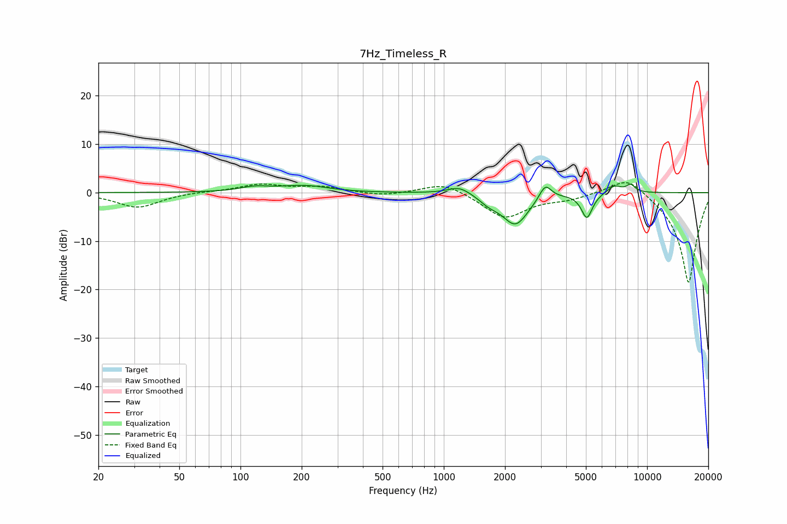

# 7Hz_Timeless_R
See [usage instructions](https://github.com/jaakkopasanen/AutoEq#usage) for more options and info.

### Parametric EQs
Apply preamp of -1.8 dB when using parametric equalizer.

|   # | Type    |   Fc (Hz) |    Q |   Gain (dB) |
|-----|---------|-----------|------|-------------|
|   1 | Peaking |       117 | 1.99 |         0.9 |
|   2 | Peaking |       210 | 1.08 |         1.7 |
|   3 | Peaking |       259 | 0.88 |        -0.3 |
|   4 | Peaking |      1196 | 2.45 |         1.7 |
|   5 | Peaking |      1674 | 2.9  |        -1.3 |
|   6 | Peaking |      2252 | 2.17 |        -6.5 |
|   7 | Peaking |      3156 | 4.71 |         3.2 |
|   8 | Peaking |      5058 | 5.18 |        -5.1 |
|   9 | Peaking |      6907 | 3.68 |         1.6 |
|  10 | Peaking |      8300 | 6    |         1.5 |

### Fixed Band EQs
When using fixed band (also called graphic) equalizer, apply preamp of **-2.1 dB** (if available) and set gains manually with these parameters.

|   # | Type    |   Fc (Hz) |    Q |   Gain (dB) |
|-----|---------|-----------|------|-------------|
|   1 | Peaking |        31 | 1.41 |        -3.1 |
|   2 | Peaking |        62 | 1.41 |         0.2 |
|   3 | Peaking |       125 | 1.41 |         1.6 |
|   4 | Peaking |       250 | 1.41 |         1.1 |
|   5 | Peaking |       500 | 1.41 |        -0.7 |
|   6 | Peaking |      1000 | 1.41 |         2.3 |
|   7 | Peaking |      2000 | 1.41 |        -5.2 |
|   8 | Peaking |      4000 | 1.41 |        -1.1 |
|   9 | Peaking |      8000 | 1.41 |         3.9 |
|  10 | Peaking |     16000 | 1.41 |       -18.9 |

### Graphs

