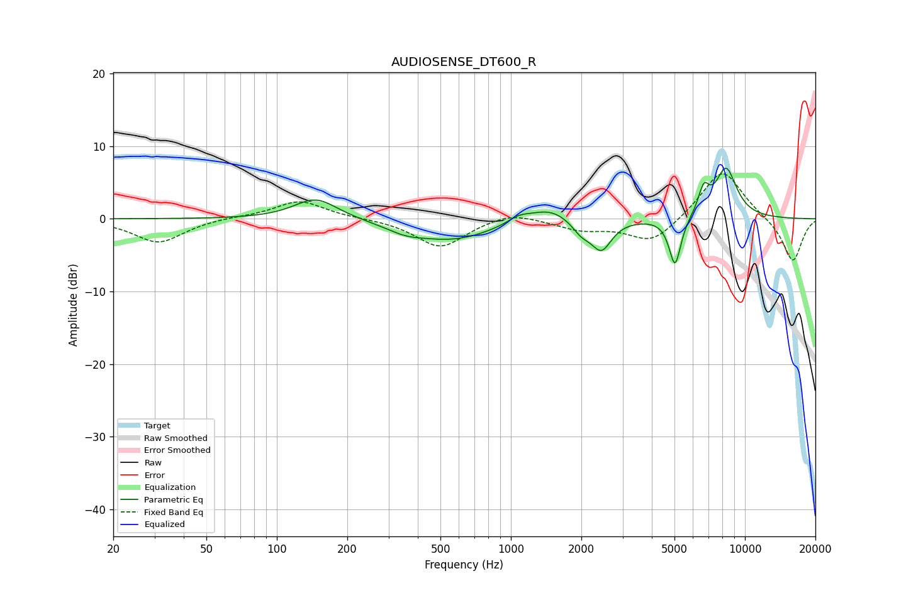

# AUDIOSENSE_DT600_R
See [usage instructions](https://github.com/jaakkopasanen/AutoEq#usage) for more options and info.

### Parametric EQs
Apply preamp of -7.1 dB when using parametric equalizer.

|   # | Type    |   Fc (Hz) |    Q |   Gain (dB) |
|-----|---------|-----------|------|-------------|
|   1 | Peaking |       147 | 1.52 |         3   |
|   2 | Peaking |       353 | 1.75 |        -0.9 |
|   3 | Peaking |       563 | 0.8  |        -2.8 |
|   4 | Peaking |      1081 | 2.83 |         0.9 |
|   5 | Peaking |      1464 | 1.62 |         1.9 |
|   6 | Peaking |      2000 | 3.44 |        -1.7 |
|   7 | Peaking |      2437 | 3.22 |        -4.1 |
|   8 | Peaking |      5027 | 5.46 |        -6.8 |
|   9 | Peaking |      6668 | 5.77 |         3.3 |
|  10 | Peaking |      8303 | 2.78 |         6.8 |

### Fixed Band EQs
When using fixed band (also called graphic) equalizer, apply preamp of **-6.3 dB** (if available) and set gains manually with these parameters.

|   # | Type    |   Fc (Hz) |    Q |   Gain (dB) |
|-----|---------|-----------|------|-------------|
|   1 | Peaking |        31 | 1.41 |        -3.3 |
|   2 | Peaking |        62 | 1.41 |         0.2 |
|   3 | Peaking |       125 | 1.41 |         2.5 |
|   4 | Peaking |       250 | 1.41 |         0.1 |
|   5 | Peaking |       500 | 1.41 |        -4   |
|   6 | Peaking |      1000 | 1.41 |         1.2 |
|   7 | Peaking |      2000 | 1.41 |        -1.4 |
|   8 | Peaking |      4000 | 1.41 |        -3.4 |
|   9 | Peaking |      8000 | 1.41 |         7   |
|  10 | Peaking |     16000 | 1.41 |        -6   |

### Graphs

