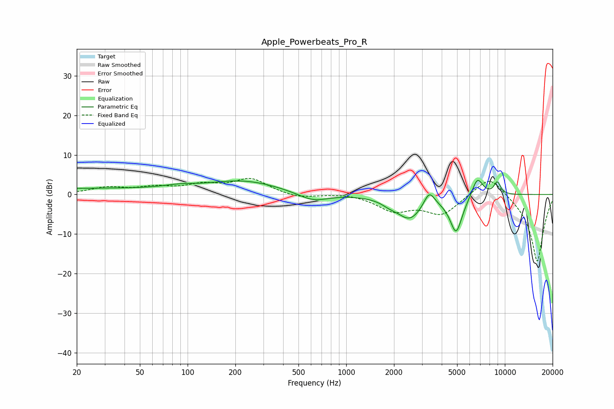

# Apple_Powerbeats_Pro_R
See [usage instructions](https://github.com/jaakkopasanen/AutoEq#usage) for more options and info.

### Parametric EQs
Apply preamp of -3.7 dB when using parametric equalizer.

|   # | Type    |   Fc (Hz) |    Q |   Gain (dB) |
|-----|---------|-----------|------|-------------|
|   1 | Peaking |        20 | 0.21 |         1.5 |
|   2 | Peaking |        89 | 1.45 |         0.7 |
|   3 | Peaking |       226 | 0.61 |         3.3 |
|   4 | Peaking |       616 | 1.45 |        -2.2 |
|   5 | Peaking |      1867 | 2.97 |        -0.9 |
|   6 | Peaking |      2511 | 1.72 |        -5.9 |
|   7 | Peaking |      3337 | 4.2  |         3.8 |
|   8 | Peaking |      4928 | 3.43 |        -9.4 |
|   9 | Peaking |      6708 | 3.8  |         5.1 |
|  10 | Peaking |      8959 | 6    |         3.1 |

### Fixed Band EQs
When using fixed band (also called graphic) equalizer, apply preamp of **-4.2 dB** (if available) and set gains manually with these parameters.

|   # | Type    |   Fc (Hz) |    Q |   Gain (dB) |
|-----|---------|-----------|------|-------------|
|   1 | Peaking |        31 | 1.41 |         1.6 |
|   2 | Peaking |        62 | 1.41 |         1.5 |
|   3 | Peaking |       125 | 1.41 |         2.1 |
|   4 | Peaking |       250 | 1.41 |         3.8 |
|   5 | Peaking |       500 | 1.41 |        -1   |
|   6 | Peaking |      1000 | 1.41 |         0.4 |
|   7 | Peaking |      2000 | 1.41 |        -3.9 |
|   8 | Peaking |      4000 | 1.41 |        -4.9 |
|   9 | Peaking |      8000 | 1.41 |         5.5 |
|  10 | Peaking |     16000 | 1.41 |       -17.2 |

### Graphs

