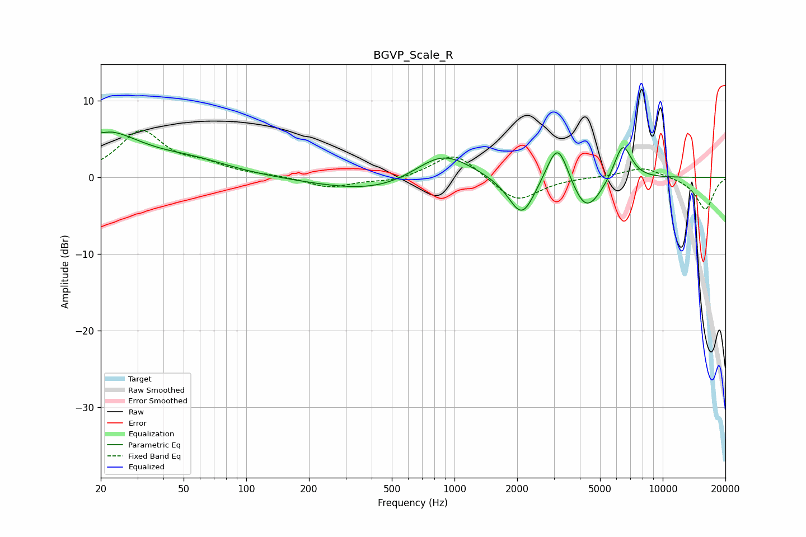

# BGVP_Scale_R
See [usage instructions](https://github.com/jaakkopasanen/AutoEq#usage) for more options and info.

### Parametric EQs
Apply preamp of -6.0 dB when using parametric equalizer.

|   # | Type    |   Fc (Hz) |    Q |   Gain (dB) |
|-----|---------|-----------|------|-------------|
|   1 | Peaking |        20 | 0.75 |         5.8 |
|   2 | Peaking |        21 | 5.99 |        -3.5 |
|   3 | Peaking |        21 | 5.98 |         3.2 |
|   4 | Peaking |        56 | 0.76 |         1.5 |
|   5 | Peaking |       484 | 0.49 |        -2.4 |
|   6 | Peaking |       871 | 0.97 |         4.5 |
|   7 | Peaking |      2109 | 2.18 |        -5.4 |
|   8 | Peaking |      3134 | 2.57 |         6.3 |
|   9 | Peaking |      4273 | 1.83 |        -5.2 |
|  10 | Peaking |      6422 | 3.17 |         5   |

### Fixed Band EQs
When using fixed band (also called graphic) equalizer, apply preamp of **-6.2 dB** (if available) and set gains manually with these parameters.

|   # | Type    |   Fc (Hz) |    Q |   Gain (dB) |
|-----|---------|-----------|------|-------------|
|   1 | Peaking |        31 | 1.41 |         5.9 |
|   2 | Peaking |        62 | 1.41 |         1.3 |
|   3 | Peaking |       125 | 1.41 |         0.2 |
|   4 | Peaking |       250 | 1.41 |        -1.4 |
|   5 | Peaking |       500 | 1.41 |        -0.6 |
|   6 | Peaking |      1000 | 1.41 |         3.4 |
|   7 | Peaking |      2000 | 1.41 |        -3.3 |
|   8 | Peaking |      4000 | 1.41 |         0   |
|   9 | Peaking |      8000 | 1.41 |         1.4 |
|  10 | Peaking |     16000 | 1.41 |        -4.2 |

### Graphs

