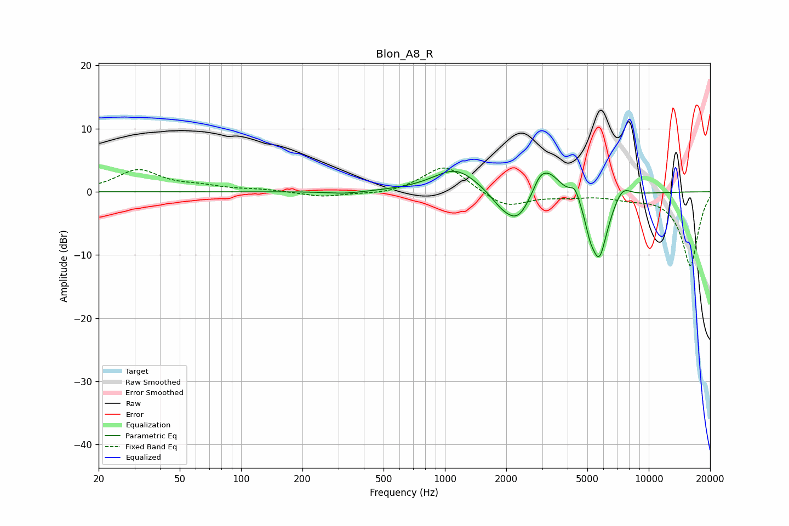

# Blon_A8_R
See [usage instructions](https://github.com/jaakkopasanen/AutoEq#usage) for more options and info.

### Parametric EQs
Apply preamp of -3.3 dB when using parametric equalizer.

|   # | Type    |   Fc (Hz) |    Q |   Gain (dB) |
|-----|---------|-----------|------|-------------|
|   1 | Peaking |       320 | 1.66 |        -0.4 |
|   2 | Peaking |      1132 | 1.26 |         3.8 |
|   3 | Peaking |      1916 | 2.15 |        -2.2 |
|   4 | Peaking |      2295 | 2.29 |        -4.3 |
|   5 | Peaking |      2916 | 4.99 |         1.1 |
|   6 | Peaking |      3183 | 2.24 |         4.1 |
|   7 | Peaking |      4347 | 5.99 |         2   |
|   8 | Peaking |      5151 | 5.97 |        -2.3 |
|   9 | Peaking |      5713 | 3.13 |       -10.4 |
|  10 | Peaking |      7411 | 3.15 |         2.2 |

### Fixed Band EQs
When using fixed band (also called graphic) equalizer, apply preamp of **-3.9 dB** (if available) and set gains manually with these parameters.

|   # | Type    |   Fc (Hz) |    Q |   Gain (dB) |
|-----|---------|-----------|------|-------------|
|   1 | Peaking |        31 | 1.41 |         3.4 |
|   2 | Peaking |        62 | 1.41 |         0.7 |
|   3 | Peaking |       125 | 1.41 |         0.3 |
|   4 | Peaking |       250 | 1.41 |        -0.8 |
|   5 | Peaking |       500 | 1.41 |        -0.5 |
|   6 | Peaking |      1000 | 1.41 |         4.4 |
|   7 | Peaking |      2000 | 1.41 |        -2.5 |
|   8 | Peaking |      4000 | 1.41 |        -0.6 |
|   9 | Peaking |      8000 | 1.41 |        -0.8 |
|  10 | Peaking |     16000 | 1.41 |       -11.7 |

### Graphs

