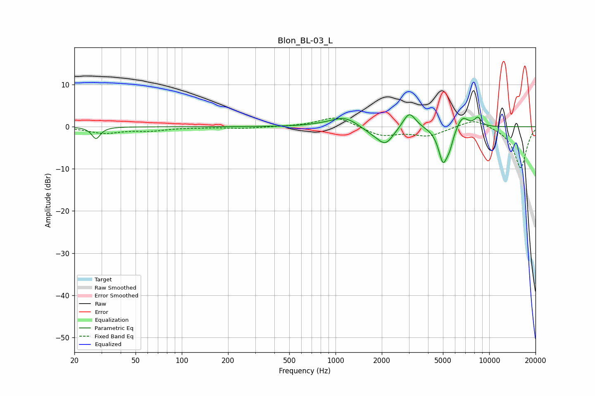

# Blon_BL-03_L
See [usage instructions](https://github.com/jaakkopasanen/AutoEq#usage) for more options and info.

### Parametric EQs
Apply preamp of -2.9 dB when using parametric equalizer.

|   # | Type    |   Fc (Hz) |    Q |   Gain (dB) |
|-----|---------|-----------|------|-------------|
|   1 | Peaking |        28 | 5.31 |        -2.8 |
|   2 | Peaking |       874 | 1.2  |         0.4 |
|   3 | Peaking |      1150 | 1.7  |         2.2 |
|   4 | Peaking |      1780 | 1.85 |        -1.4 |
|   5 | Peaking |      2121 | 2.75 |        -3.6 |
|   6 | Peaking |      3019 | 3.43 |         4   |
|   7 | Peaking |      5007 | 4.51 |        -8.1 |
|   8 | Peaking |      5528 | 6    |        -2.7 |
|   9 | Peaking |      6699 | 3.63 |         2.9 |
|  10 | Peaking |      8432 | 5.63 |         2   |

### Fixed Band EQs
When using fixed band (also called graphic) equalizer, apply preamp of **-2.1 dB** (if available) and set gains manually with these parameters.

|   # | Type    |   Fc (Hz) |    Q |   Gain (dB) |
|-----|---------|-----------|------|-------------|
|   1 | Peaking |        31 | 1.41 |        -1.5 |
|   2 | Peaking |        62 | 1.41 |        -0.8 |
|   3 | Peaking |       125 | 1.41 |        -0.1 |
|   4 | Peaking |       250 | 1.41 |        -0.4 |
|   5 | Peaking |       500 | 1.41 |         0   |
|   6 | Peaking |      1000 | 1.41 |         2.5 |
|   7 | Peaking |      2000 | 1.41 |        -2.1 |
|   8 | Peaking |      4000 | 1.41 |        -2.1 |
|   9 | Peaking |      8000 | 1.41 |         2.1 |
|  10 | Peaking |     16000 | 1.41 |        -9.9 |

### Graphs

