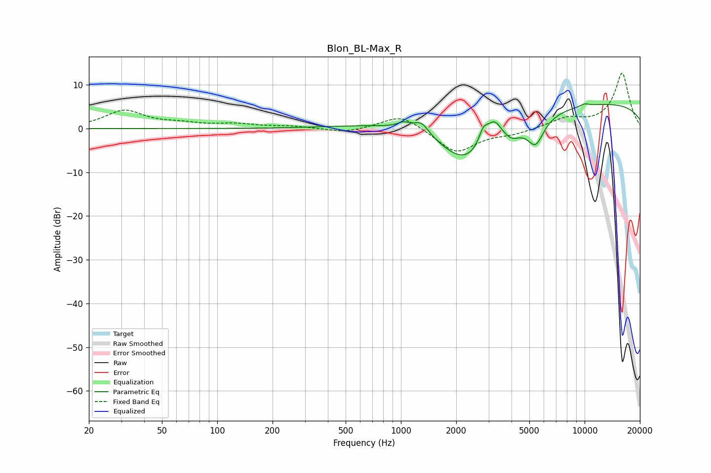

# Blon_BL-Max_R
See [usage instructions](https://github.com/jaakkopasanen/AutoEq#usage) for more options and info.

### Parametric EQs
Apply preamp of -5.8 dB when using parametric equalizer.

|   # | Type    |   Fc (Hz) |    Q |   Gain (dB) |
|-----|---------|-----------|------|-------------|
|   1 | Peaking |      1037 | 3.91 |         1.3 |
|   2 | Peaking |      1295 | 3.49 |         2.8 |
|   3 | Peaking |      1419 | 0.44 |         3.4 |
|   4 | Peaking |      2234 | 0.77 |       -12.9 |
|   5 | Peaking |      2812 | 5.78 |         3.3 |
|   6 | Peaking |      3218 | 3.51 |         4.6 |
|   7 | Peaking |      4017 | 2.95 |        -2.3 |
|   8 | Peaking |      5410 | 3.01 |        -6.1 |
|   9 | Peaking |     10000 | 0.18 |         6.1 |
|  10 | Peaking |     10000 | 5.37 |         0.6 |

### Fixed Band EQs
When using fixed band (also called graphic) equalizer, apply preamp of **-12.7 dB** (if available) and set gains manually with these parameters.

|   # | Type    |   Fc (Hz) |    Q |   Gain (dB) |
|-----|---------|-----------|------|-------------|
|   1 | Peaking |        31 | 1.41 |         4   |
|   2 | Peaking |        62 | 1.41 |         0.9 |
|   3 | Peaking |       125 | 1.41 |         0.9 |
|   4 | Peaking |       250 | 1.41 |         0.5 |
|   5 | Peaking |       500 | 1.41 |        -1   |
|   6 | Peaking |      1000 | 1.41 |         3.4 |
|   7 | Peaking |      2000 | 1.41 |        -5.6 |
|   8 | Peaking |      4000 | 1.41 |        -1.1 |
|   9 | Peaking |      8000 | 1.41 |         2.2 |
|  10 | Peaking |     16000 | 1.41 |        12.7 |

### Graphs

